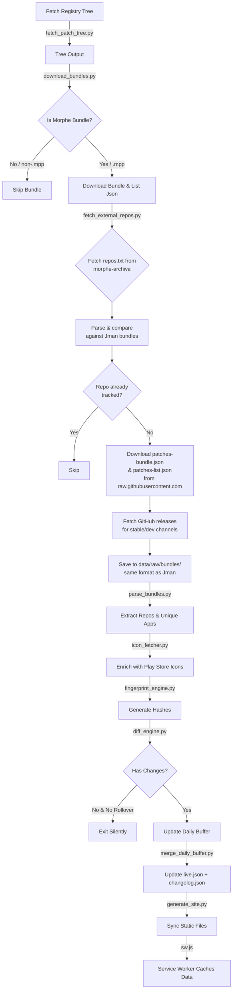

# Morphe Patch Tracker

<p align="center">
    
</p>

An automated compatibility, patch discovery, and update monitoring system for Morphe application patches. This repository monitors multiple patch sources and generates a premium static web dashboard showing compatible apps, release channels, and change history.

This repository was inspired by and built upon concepts from the awesome [awesome-for-morphe](https://github.com/nvbangg/awesome-for-morphe) repository by [@nvbangg](https://github.com/nvbangg).

---

## 🚀 Features

- **Automated Scanning**: Tracks patch bundle releases published to the `Jman-Github/ReVanced-Patch-Bundles` registry.
- **External Repo Discovery**: Fetches community-maintained `repos.txt` from `rushiforai/morphe-archive`, compares it against Jman's bundles, and auto-downloads patch bundles from any external GitHub repos not yet tracked.
- **GitLab & GitHub Support**: Seamlessly parses, validates, and links both GitHub and GitLab source repositories.
- **Multi-channel Monitoring**: Supports both `stable` and `dev` release channels.
- **Smart Change Detection**: Deduplicates consecutive scans via hash-based fingerprints, generating clean historical changelogs.
- **App Icons**: Automatically fetches and caches app icons from Google Play Store.
- **Offline-ready Caching**: Service Worker provides stale-while-revalidate caching for data files and cache-first for static assets.
- **Full Changelog History**: Dedicated changelog viewer with daily rollups of added, updated, and removed apps.

- **Dynamic Web Dashboard**: Beautiful, responsive dark-themed dashboard presenting all patch bundles, compatible apps, and change summaries.
- **Add-to-Source Links**: Dynamic generation of one-click action links to load patch sources directly into the Morphe app.

---

## 📂 Repository Layout

```
MorpheTracker/
├── sw.js                    # Service Worker (stale-while-revalidate + cache-first)
├── assets/                  # CSS styles and static site client JavaScript
├── data/
│   ├── raw/                 # Downloaded registry trees, raw JSON files, and parsed caches
│   ├── state/               # Pipeline execution states, snapshots, buffers, and icon cache
│   ├── output/              # Generated changelog.json and changelog.md
│   ├── repos_list.txt       # All known external repos (owner/repo + GitHub link)
│   └── live.json            # Aggregated database driving the dashboard
├── docs/                    # Optional host location for GH-Pages static website
├── scripts/                 # Core Python pipeline engine scripts
│   ├── fetch_patch_tree.py  # Crawls the central patch bundles tree
│   ├── download_bundles.py  # Filters and downloads Morphe bundle lists
│   ├── parse_bundles.py     # Parses packages, authors, and verifies MPP compatibility
│   ├── icon_fetcher.py      # Scrapes Google Play Store icons with persistent cache
│   ├── fetch_external_repos.py # Discovers & downloads patches from external repos
│   ├── fingerprint_engine.py# Generates bundle hashes to prevent redundant changes
│   ├── diff_engine.py       # Computes additions, updates, and removals of apps
│   ├── merge_daily_buffer.py# Buffers scans and updates statistics (live.json)
│   ├── generate_site.py     # Syncs static files to survive CI checkouts
│   └── run_pipeline.py      # Main entry orchestrator
├── index.html               # Main dashboard web app entry
├── changelog.html           # Historical changelog viewer
└── README.md                # Documentation (this file)
```

---

## ⚙️ Flow Logic & Pipeline Architecture

The update pipeline runs periodically (e.g., via GitHub Actions) and follows these steps:



### 1. File Discovery (`fetch_patch_tree.py`)
Queries the GitHub Git Trees API for `Jman-Github/ReVanced-Patch-Bundles` recursive tree on the `bundles` branch. It stores the metadata of all discovered files under `patch-bundles/` in `tree.json`.

### 2. Downloader & Filter (`download_bundles.py`)
Iterates over the discovered tree. It parses `patches-bundle.json` files and performs the critical check:
- If a bundle's `download_url` points to a `.mpp` binary (Morphe Patch Package) and matches the correct structure, it proceeds. Otherwise, it is skipped.
- Downloads files into `data/raw/bundles/<bundle_name>/<channel>/` locally.

### 2b. External Repo Discovery (`fetch_external_repos.py`)
A supplementary step that broadens coverage beyond Jman's central registry:

- Fetches `repos.txt` from the community [`rushiforai/morphe-archive`](https://github.com/rushiforai/morphe-archive) — a curated list of all known Morphe patch repositories.
- Scans the already-downloaded `data/raw/bundles/` directory to build a set of repo URLs already present in Jman's bundles.
- Filters out repos that are already tracked, and skips known non-patch repos (e.g., `builder-for-morphe`, `awesome-revanced`).
- For each untracked repo:
  1. Fetches `patches-bundle.json` and `patches-list.json` directly from `raw.githubusercontent.com` (tries `main`, then `master`).
  2. Validates the bundle has a `.mpp` download URL.
  3. Fetches GitHub releases via the API to determine stable vs. dev channel and version tags.
  4. Writes the bundle files into `data/raw/bundles/<slug>/<channel>/` — the exact same directory structure used by Jman bundles.
- Saves/refreshes `data/repos_list.txt` — a local text file listing all known repos with their `owner/repo -> https://github.com/owner/repo` mapping and a sortable list of every tracked repo.

**Key insight:** Once external repos are downloaded, they are treated identically to Jman bundles by every downstream pipeline step (parsing, fingerprinting, diffing, merging, dashboard rendering). The pipeline does not distinguish between a bundle that came from the central registry vs. an external repo.

---

### 3. Parser & Icon Enrichment (`parse_bundles.py` & `icon_fetcher.py`)
Parses downloaded bundles, checks package compatibility lists (`compatiblePackages`), maps package identifiers to user-friendly titles, and extracts the correct repository URLs and usernames by parsing the release's `download_url`. Each app is then enriched with a Google Play Store icon by scraping the `og:image` meta tag; results are cached in `data/state/icon_cache.json` to avoid re-scraping every pipeline run.

### 4. Fingerprint & Diff (`fingerprint_engine.py` & `diff_engine.py`)
Computes SHA-256 hashes of the parsed files. It compares the current scan snapshot with the previous snapshot:
- Detects if any bundle versions have been upgraded/downgraded.
- Detects if any compatible applications have been added, updated, or removed.

### 5. Finalizer (`merge_daily_buffer.py`)
Consolidates changes within a 24-hour window to keep notifications clean. It computes global statistics:
- **Total Bundles**: Counts unique bundles by checking name and repository (stable and dev release channels under the same bundle name and repo count as **1**).
- **Total Apps**: Counts unique app package names across all bundles.
- Saves the database output to `data/core.json`, `data/stats.json`, `data/changes.json`, and `data/bundles.json`.

### 6. Static Site Sync (`generate_site.py`)
Reads files from disk and writes them back to preserve them during CI checkouts. Also copies `changelog.json` to `data/changelog.json` for the web frontend. The actual working static files are maintained directly on disk — this script simply ensures they survive a fresh GitHub Actions checkout.

---

## 👏 Credits

### Inspiration
- [@nvbangg](https://github.com/nvbangg) — [awesome-for-morphe](https://github.com/nvbangg/awesome-for-morphe) served as the template and inspiration for this dashboard.
- [@rushiforai](https://github.com/rushiforai) — [morphe-archive](https://github.com/rushiforai/morphe-archive) maintains the community `repos.txt` that feeds the external repo discovery.

### Central Registry
- [@Jman-Github](https://github.com/Jman-Github) — [ReVanced-Patch-Bundles](https://github.com/Jman-Github/ReVanced-Patch-Bundles) is the primary upstream registry.

### All Patch Authors

Thanks to every developer who publishes Morphe patches. The full up-to-date list is maintained in [`data/repos_list.txt`](data/repos_list.txt) (85+ repos), including:

| # | Repo | Author |
|---|------|--------|
| 1 | [AlexNaga/android-patches](https://github.com/AlexNaga/android-patches) | [@AlexNaga](https://github.com/AlexNaga) |
| 2 | [Almewty/my-morphe-patches](https://github.com/Almewty/my-morphe-patches) | [@Almewty](https://github.com/Almewty) |
| 3 | [AmpleReVanced/revanced-patches](https://github.com/AmpleReVanced/revanced-patches) | [@AmpleReVanced](https://github.com/AmpleReVanced) |
| 4 | [BholeyKaBhakt/android-patches-xtra](https://github.com/BholeyKaBhakt/android-patches-xtra) | [@BholeyKaBhakt](https://github.com/BholeyKaBhakt) |
| 5 | [BrayDog2010/morphe-patches](https://github.com/BrayDog2010/morphe-patches) | [@BrayDog2010](https://github.com/BrayDog2010) |
| 6 | [Graywizard888/Enhancify](https://github.com/Graywizard888/Enhancify) | [@Graywizard888](https://github.com/Graywizard888) |
| 7 | [HellveticaStandard/HellveticaPatches](https://github.com/HellveticaStandard/HellveticaPatches) | [@HellveticaStandard](https://github.com/HellveticaStandard) |
| 8 | [HvQ/eksi-morphe](https://github.com/HvQ/eksi-morphe) | [@HvQ](https://github.com/HvQ) |
| 9 | [IMXEren/mix-patches](https://github.com/IMXEren/mix-patches) | [@IMXEren](https://github.com/IMXEren) |
| 10 | [ImmortalZeus/ImmortalZeus-Morphe-Patches](https://github.com/ImmortalZeus/ImmortalZeus-Morphe-Patches) | [@ImmortalZeus](https://github.com/ImmortalZeus) |
| 11 | [Joristdh/Platypatch](https://github.com/Joristdh/Platypatch) | [@Joristdh](https://github.com/Joristdh) |
| 12 | [LaKakaReal/LaKakaShitPatches](https://github.com/LaKakaReal/LaKakaShitPatches) | [@LaKakaReal](https://github.com/LaKakaReal) |
| 13 | [Lynx6319/patch-youtube-scroll-block](https://github.com/Lynx6319/patch-youtube-scroll-block) | [@Lynx6319](https://github.com/Lynx6319) |
| 14 | [MoonShadowKeeper/Telegram-patchesMorphe](https://github.com/MoonShadowKeeper/Telegram-patchesMorphe) | [@MoonShadowKeeper](https://github.com/MoonShadowKeeper) |
| 15 | [MorpheApp/morphe-patches](https://github.com/MorpheApp/morphe-patches) | [@MorpheApp](https://github.com/MorpheApp) |
| 16 | [Pa-kon/morphe-screenshot-patches](https://github.com/Pa-kon/morphe-screenshot-patches) | [@Pa-kon](https://github.com/Pa-kon) |
| 17 | [Paresh-Maheshwari/paresh-patches](https://github.com/Paresh-Maheshwari/paresh-patches) | [@Paresh-Maheshwari](https://github.com/Paresh-Maheshwari) |
| 18 | [PawiX25/pepper-morphe-patches](https://github.com/PawiX25/pepper-morphe-patches) | [@PawiX25](https://github.com/PawiX25) |
| 19 | [PixelPusher247/morphe-patches](https://github.com/PixelPusher247/morphe-patches) | [@PixelPusher247](https://github.com/PixelPusher247) |
| 20 | [PrathxmOp/Prathxm-Patches](https://github.com/PrathxmOp/Prathxm-Patches) | [@PrathxmOp](https://github.com/PrathxmOp) |
| 21 | [PrathxmOp/ytmusic-patches](https://github.com/PrathxmOp/ytmusic-patches) | [@PrathxmOp](https://github.com/PrathxmOp) |
| 22 | [Quantro100/Morphe-patches](https://github.com/Quantro100/Morphe-patches) | [@Quantro100](https://github.com/Quantro100) |
| 23 | [RealCyberwash/max-patches](https://github.com/RealCyberwash/max-patches) | [@RealCyberwash](https://github.com/RealCyberwash) |
| 24 | [RookieEnough/De-Vanced](https://github.com/RookieEnough/De-Vanced) | [@RookieEnough](https://github.com/RookieEnough) |
| 25 | [Trimpsuz/morphe-busuu](https://github.com/Trimpsuz/morphe-busuu) | [@Trimpsuz](https://github.com/Trimpsuz) |
| 26 | [TrollTaylor/morphe-pause-fix](https://github.com/TrollTaylor/morphe-pause-fix) | [@TrollTaylor](https://github.com/TrollTaylor) |
| 27 | [Xisrr1/Revancify-Xisr](https://github.com/Xisrr1/Revancify-Xisr) | [@Xisrr1](https://github.com/Xisrr1) |
| 28 | [abdul-hubbali/Morphe-Fork](https://github.com/abdul-hubbali/Morphe-Fork) | [@abdul-hubbali](https://github.com/abdul-hubbali) |
| 29 | [abhis1n/Morphe-Patches](https://github.com/abhis1n/Morphe-Patches) | [@abhis1n](https://github.com/abhis1n) |
| 30 | [ajstrick81/morphe-androidtv-patches](https://github.com/ajstrick81/morphe-androidtv-patches) | [@ajstrick81](https://github.com/ajstrick81) |
| 31 | [ameenalasady/ameen-morphe](https://github.com/ameenalasady/ameen-morphe) | [@ameenalasady](https://github.com/ameenalasady) |
| 32 | [ameenalasady/photogrid-morphe](https://github.com/ameenalasady/photogrid-morphe) | [@ameenalasady](https://github.com/ameenalasady) |
| 33 | [anddea/revanced-patches](https://github.com/anddea/revanced-patches) | [@anddea](https://github.com/anddea) |
| 34 | [andronedev/morphe-patches](https://github.com/andronedev/morphe-patches) | [@andronedev](https://github.com/andronedev) |
| 35 | [andronedev/morphe-portal-patch](https://github.com/andronedev/morphe-portal-patch) | [@andronedev](https://github.com/andronedev) |
| 36 | [arandomhooman/hoomans-morphe-patches](https://github.com/arandomhooman/hoomans-morphe-patches) | [@arandomhooman](https://github.com/arandomhooman) |
| 37 | [ariecos/gemini-patches](https://github.com/ariecos/gemini-patches) | [@ariecos](https://github.com/ariecos) |
| 38 | [bdgerszewski/morphe-patches-ihealth](https://github.com/bdgerszewski/morphe-patches-ihealth) | [@bdgerszewski](https://github.com/bdgerszewski) |
| 39 | [bigyank/morphe-patches-samsung](https://github.com/bigyank/morphe-patches-samsung) | [@bigyank](https://github.com/bigyank) |
| 40 | [binarymend/morphe-patches](https://github.com/binarymend/morphe-patches) | [@binarymend](https://github.com/binarymend) |
| 41 | [brosssh/morphe-patches](https://github.com/brosssh/morphe-patches) | [@brosssh](https://github.com/brosssh) |
| 42 | [browzomje/browzomje-patches](https://github.com/browzomje/browzomje-patches) | [@browzomje](https://github.com/browzomje) |
| 43 | [bufferk/bounce-patch](https://github.com/bufferk/bounce-patch) | [@bufferk](https://github.com/bufferk) |
| 44 | [cesbar/zpatches](https://github.com/cesbar/zpatches) | [@cesbar](https://github.com/cesbar) |
| 45 | [crimera/piko](https://github.com/crimera/piko) | [@crimera](https://github.com/crimera) |
| 46 | [docbt/patched-up](https://github.com/docbt/patched-up) | [@docbt](https://github.com/docbt) |
| 47 | [dumb-software/T2C-App-Patch-Morphe](https://github.com/dumb-software/T2C-App-Patch-Morphe) | [@dumb-software](https://github.com/dumb-software) |
| 48 | [durgesh0505/chiggi_morphe_patches](https://github.com/durgesh0505/chiggi_morphe_patches) | [@durgesh0505](https://github.com/durgesh0505) |
| 49 | [early.egg3707/ee-morphe-patches](https://github.com/early.egg3707/ee-morphe-patches) | [@early.egg3707](https://github.com/early.egg3707) |
| 50 | [eyalm2000/tidal-debug-menu](https://github.com/eyalm2000/tidal-debug-menu) | [@eyalm2000](https://github.com/eyalm2000) |
| 51 | [hackingguy/morphe-patches](https://github.com/hackingguy/morphe-patches) | [@hackingguy](https://github.com/hackingguy) |
| 52 | [hoo-dles/jadx-morphe](https://github.com/hoo-dles/jadx-morphe) | [@hoo-dles](https://github.com/hoo-dles) |
| 53 | [hoo-dles/morphe-patches](https://github.com/hoo-dles/morphe-patches) | [@hoo-dles](https://github.com/hoo-dles) |
| 54 | [humzakh/HK-Morphe-Patches](https://github.com/humzakh/HK-Morphe-Patches) | [@humzakh](https://github.com/humzakh) |
| 55 | [icysymmetra/tiktok-patches-for-morphe](https://github.com/icysymmetra/tiktok-patches-for-morphe) | [@icysymmetra](https://github.com/icysymmetra) |
| 56 | [inotia00/proguard-patches](https://github.com/inotia00/proguard-patches) | [@inotia00](https://github.com/inotia00) |
| 57 | [inotia00/x-shim](https://github.com/inotia00/x-shim) | [@inotia00](https://github.com/inotia00) |
| 58 | [isuruhg/fin-tweaks](https://github.com/isuruhg/fin-tweaks) | [@isuruhg](https://github.com/isuruhg) |
| 59 | [jasonwu1994/Gboard-patches](https://github.com/jasonwu1994/Gboard-patches) | [@jasonwu1994](https://github.com/jasonwu1994) |
| 60 | [jkennethcarino/adobo](https://github.com/jkennethcarino/adobo) | [@jkennethcarino](https://github.com/jkennethcarino) |
| 61 | [kareemlukitomo/morphe-patches](https://github.com/kareemlukitomo/morphe-patches) | [@kareemlukitomo](https://github.com/kareemlukitomo) |
| 62 | [kiraio-moe/Lain-Patches](https://github.com/kiraio-moe/Lain-Patches) | [@kiraio-moe](https://github.com/kiraio-moe) |
| 63 | [kolaron/morphe-patches](https://github.com/kolaron/morphe-patches) | [@kolaron](https://github.com/kolaron) |
| 64 | [kondratjev/morphe-patches](https://github.com/kondratjev/morphe-patches) | [@kondratjev](https://github.com/kondratjev) |
| 65 | [kontsevoye/emorphe-patches](https://github.com/kontsevoye/emorphe-patches) | [@kontsevoye](https://github.com/kontsevoye) |
| 66 | [kun-codes/npci-bhim-morphe-patches](https://github.com/kun-codes/npci-bhim-morphe-patches) | [@kun-codes](https://github.com/kun-codes) |
| 67 | [loskutov/youtube-domain-fronting-patch](https://github.com/loskutov/youtube-domain-fronting-patch) | [@loskutov](https://github.com/loskutov) |
| 68 | [lyyako/realme-link-patches](https://github.com/lyyako/realme-link-patches) | [@lyyako](https://github.com/lyyako) |
| 69 | [meridianfresco/morphe-meta-patches](https://github.com/meridianfresco/morphe-meta-patches) | [@meridianfresco](https://github.com/meridianfresco) |
| 70 | [nvbangg/builder-for-morphe](https://github.com/nvbangg/builder-for-morphe) | [@nvbangg](https://github.com/nvbangg) |
| 71 | [osirisad/teamsnap-patches](https://github.com/osirisad/teamsnap-patches) | [@osirisad](https://github.com/osirisad) |
| 72 | [osirisad/ts-patches](https://github.com/osirisad/ts-patches) | [@osirisad](https://github.com/osirisad) |
| 73 | [polka-bear/morphe-patches](https://github.com/polka-bear/morphe-patches) | [@polka-bear](https://github.com/polka-bear) |
| 74 | [quantavil/edge-morphe-patches](https://github.com/quantavil/edge-morphe-patches) | [@quantavil](https://github.com/quantavil) |
| 75 | [rabilrbl/fluffy-patches](https://github.com/rabilrbl/fluffy-patches) | [@rabilrbl](https://github.com/rabilrbl) |
| 76 | [sjshb57/Pairip-Patches](https://github.com/sjshb57/Pairip-Patches) | [@sjshb57](https://github.com/sjshb57) |
| 77 | [vladon/morphe-patches-navi](https://github.com/vladon/morphe-patches-navi) | [@vladon](https://github.com/vladon) |
| 78 | [wchill/anddea-rvx-morphed](https://github.com/wchill/anddea-rvx-morphed) | [@wchill](https://github.com/wchill) |
| 79 | [wchill/patcheddit](https://github.com/wchill/patcheddit) | [@wchill](https://github.com/wchill) |
| 80 | [wchill/rvx-morphed](https://github.com/wchill/rvx-morphed) | [@wchill](https://github.com/wchill) |
| 81 | [xob0t/morphe-patches](https://github.com/xob0t/morphe-patches) | [@xob0t](https://github.com/xob0t) |
| 82 | [ynotzort/morphe-patches](https://github.com/ynotzort/morphe-patches) | [@ynotzort](https://github.com/ynotzort) |

Missing or new? Check [`data/repos_list.txt`](data/repos_list.txt) for the most current list.

---

## Star History


<a href="https://www.star-history.com/?type=date&repos=drnx64%2Fmorphe-track-patches">
 <picture>
   <source media="(prefers-color-scheme: dark)" srcset="https://api.star-history.com/chart?repos=drnx64/morphe-track-patches&type=date&theme=dark&legend=top-left" />
   <source media="(prefers-color-scheme: light)" srcset="https://api.star-history.com/chart?repos=drnx64/morphe-track-patches&type=date&legend=top-left" />
   
 </picture>
</a>

---

*Built with ❤️ for the Morphe community.*
