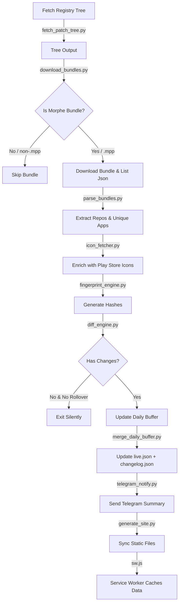

# Morphe Patch Tracker

<p align="center">
    
</p>

An automated compatibility, patch discovery, and update monitoring system for Morphe application patches. This repository monitors multiple patch sources and generates a premium static web dashboard showing compatible apps, release channels, and change history.

This repository was inspired by and built upon concepts from the awesome [awesome-for-morphe](https://github.com/nvbangg/awesome-for-morphe) repository by [@nvbangg](https://github.com/nvbangg).

---

## 🚀 Features

- **Automated Scanning**: Tracks patch bundle releases published to the `Jman-Github/ReVanced-Patch-Bundles` registry.
- **GitLab & GitHub Support**: Seamlessly parses, validates, and links both GitHub and GitLab source repositories.
- **Multi-channel Monitoring**: Supports both `stable` and `dev` release channels.
- **Smart Change Detection**: Deduplicates consecutive scans via hash-based fingerprints, generating clean historical changelogs.
- **App Icons**: Automatically fetches and caches app icons from Google Play Store.
- **Offline-ready Caching**: Service Worker provides stale-while-revalidate caching for data files and cache-first for static assets.
- **Full Changelog History**: Dedicated changelog viewer with daily rollups of added, updated, and removed apps.
- **Telegram Notifications**: Sends daily changelog summaries to a configured Telegram channel.
- **Dynamic Web Dashboard**: Beautiful, responsive dark-themed dashboard presenting all patch bundles, compatible apps, and change summaries.
- **Add-to-Source Links**: Dynamic generation of one-click action links to load patch sources directly into the Morphe app.

---

## 📂 Repository Layout

```
MorpheTracker/
├── sw.js                    # Service Worker (stale-while-revalidate + cache-first)
├── assets/                  # CSS styles and static site client JavaScript
├── data/
│   ├── raw/                 # Downloaded registry trees, raw JSON files, and parsed caches
│   ├── state/               # Pipeline execution states, snapshots, buffers, and icon cache
│   ├── output/              # Generated changelog.json and changelog.md
│   └── live.json            # Aggregated database driving the dashboard
├── docs/                    # Optional host location for GH-Pages static website
├── scripts/                 # Core Python pipeline engine scripts
│   ├── fetch_patch_tree.py  # Crawls the central patch bundles tree
│   ├── download_bundles.py  # Filters and downloads Morphe bundle lists
│   ├── parse_bundles.py     # Parses packages, authors, and verifies MPP compatibility
│   ├── icon_fetcher.py      # Scrapes Google Play Store icons with persistent cache
│   ├── fingerprint_engine.py# Generates bundle hashes to prevent redundant changes
│   ├── diff_engine.py       # Computes additions, updates, and removals of apps
│   ├── merge_daily_buffer.py# Buffers scans and updates statistics (live.json)
│   ├── generate_site.py     # Syncs static files to survive CI checkouts
│   ├── telegram_notify.py   # Sends daily changelog to Telegram
│   └── run_pipeline.py      # Main entry orchestrator
├── index.html               # Main dashboard web app entry
├── changelog.html           # Historical changelog viewer
└── README.md                # Documentation (this file)
```

---

## ⚙️ Flow Logic & Pipeline Architecture

The update pipeline runs periodically (e.g., via GitHub Actions) and follows these steps:



### 1. File Discovery (`fetch_patch_tree.py`)
Queries the GitHub Git Trees API for `Jman-Github/ReVanced-Patch-Bundles` recursive tree on the `bundles` branch. It stores the metadata of all discovered files under `patch-bundles/` in `tree.json`.

### 2. Downloader & Filter (`download_bundles.py`)
Iterates over the discovered tree. It parses `patches-bundle.json` files and performs the critical check:
- If a bundle's `download_url` points to a `.mpp` binary (Morphe Patch Package) and matches the correct structure, it proceeds. Otherwise, it is skipped.
- Downloads files into `data/raw/bundles/<bundle_name>/<channel>/` locally.

### 3. Parser & Icon Enrichment (`parse_bundles.py` & `icon_fetcher.py`)
Parses downloaded bundles, checks package compatibility lists (`compatiblePackages`), maps package identifiers to user-friendly titles, and extracts the correct repository URLs and usernames by parsing the release's `download_url`. Each app is then enriched with a Google Play Store icon by scraping the `og:image` meta tag; results are cached in `data/state/icon_cache.json` to avoid re-scraping every pipeline run.

### 4. Fingerprint & Diff (`fingerprint_engine.py` & `diff_engine.py`)
Computes SHA-256 hashes of the parsed files. It compares the current scan snapshot with the previous snapshot:
- Detects if any bundle versions have been upgraded/downgraded.
- Detects if any compatible applications have been added, updated, or removed.

### 5. Finalizer (`merge_daily_buffer.py`)
Consolidates changes within a 24-hour window to keep notifications clean. It computes global statistics:
- **Total Bundles**: Counts unique bundles by checking name and repository (stable and dev release channels under the same bundle name and repo count as **1**).
- **Total Apps**: Counts unique app package names across all bundles.
- Saves the database output to `data/live.json`.

### 6. Static Site Sync (`generate_site.py`)
Reads files from disk and writes them back to preserve them during CI checkouts. Also copies `changelog.json` to `data/changelog.json` for the web frontend. The actual working static files are maintained directly on disk — this script simply ensures they survive a fresh GitHub Actions checkout.

---

## 👏 Credits & Inspiration

Special thanks to [@nvbangg](https://github.com/nvbangg) for his work on [awesome-for-morphe](https://github.com/nvbangg/awesome-for-morphe). His repository's clean design, async bundle fetching, and structured JSON parsing served as the template and inspiration for this automated monitoring dashboard.

---

## Star History


<a href="https://www.star-history.com/?type=date&repos=drnx64%2Fmorphe-track-patches">
 <picture>
   <source media="(prefers-color-scheme: dark)" srcset="https://api.star-history.com/chart?repos=drnx64/morphe-track-patches&type=date&theme=dark&legend=top-left" />
   <source media="(prefers-color-scheme: light)" srcset="https://api.star-history.com/chart?repos=drnx64/morphe-track-patches&type=date&legend=top-left" />
   
 </picture>
</a>

---

*Built with ❤️ for the Morphe community.*
