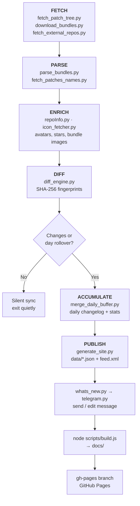

<p align="center">
  
</p>

<h1 align="center">Morphe Patch Tracker</h1>

<p align="center">
  <em>Automated patch discovery, compatibility tracking & change monitoring for the Morphe ecosystem</em>
</p>

<p align="center">
  <a href="https://drnx64.github.io/morphe-track-patches/">
    
  </a>
  <br>
  
  
  
  
  
  
</p>

<p align="center">
  
  
  
  
</p>

---

## What is this?

Morphe Patch Tracker watches public **Morphe** patch bundle repositories and turns
them into one searchable, comparable dashboard. It crawls the ecosystem, discovers new
patch authors automatically, parses every bundle's compatible apps and patches,
detects exactly what changed using SHA-256 fingerprinting, and publishes the result as
a fully static site.

| Metric | Detail |
|---|---|
| **301** patch source repos | auto-discovered from community lists (GitHub + GitLab) |
| **275** distinct authors | every source links back to its owner below |
| **234** bundle channels | `stable` + `dev` |
| **903** tracked apps | with Play Store icons, versions and patch descriptions |
| **Hourly** runs | GitHub Actions → commit data → build → GitHub Pages |

Everything is transparent: the pipeline runs in CI, commits its own state back to
`main`, and the site is rebuilt from `docs/` on every push.

---

## Features

<table>
<tr>
<td width="50%">

### Pipeline

- **Registry crawl** — discovers `.mpp` bundles via the GitHub Git Trees API
- **Community discovery** — pulls the `repos.txt` list to find untracked sources
- **GitHub + GitLab** — both platforms parsed, including subgroup paths
- **Multi-channel** — separate `stable` and `dev` release tracking
- **Release cache** — GitHub releases resolved only for bundles that changed
- **Fingerprinting** — SHA-256 per patch, so only real changes surface
- **Daily changelog** — changes accumulate per UTC day, then roll over
- **Telegram notify** — same-day summary that gets *edited* instead of spamming

</td>
<td width="50%">

### Dashboard

- **Dependency-free SPA** — vanilla ES modules, hash routing, zero `node_modules`
- **Apps view** — every tracked app with icons, bundles and compatible versions
- **Bundle detail** — per-bundle patch list with history modal
- **Patch Explorer** — search an app, see its patches across every bundle
- **Presence matrix** — which patches are shared, unique or *differ* per bundle
- **Word-level diff** — description/version changes rendered inline
- **Changelog** — daily rollups with RSS (`feed.xml`)
- **Add-to-Morphe links** — one tap to add a patch source inside the app

</td>
</tr>
</table>

---

## Tech Stack

No framework, no bundler, no dependency manager.

<table>
<tr>
<td align="center" width="16%">
  <br>
  <strong>Vanilla JS (ESM)</strong><br>
  <sub>Frontend · 0 deps</sub>
</td>
<td align="center" width="16%">
  <br>
  <strong>Python 3.11</strong><br>
  <sub>Pipeline · stdlib urllib</sub>
</td>
<td align="center" width="16%">
  <br>
  <strong>GitHub Actions</strong><br>
  <sub>CI + hourly runs</sub>
</td>
<td align="center" width="16%">
  <br>
  <strong>GitHub Pages</strong><br>
  <sub>Hosting · gh-pages</sub>
</td>
<td align="center" width="16%">
  <br>
  <strong>Pillow</strong><br>
  <sub>Image processing</sub>
</td>
<td align="center" width="16%">
  <br>
  <strong>pytest</strong><br>
  <sub>30 tests</sub>
</td>
</tr>
</table>

**Runtime dependencies:** none. `package.json` exists only to expose `npm run dev`,
`npm run build` and `npm run preview` — `npm install` is a no-op. Python deps are just
`Pillow` and `pytest`.

---

## Quick Start

```bash
# 1. Clone
git clone https://github.com/drnx64/morphe-track-patches.git
cd morphe-track-patches

# 2. Run the site (serves the repo root on http://localhost:3000)
npm run dev

# 3. Run the tests (no install needed beyond Pillow + pytest)
pip install -r requirements.txt
python -m pytest tests/ -v
```

### Running the pipeline locally

```bash
export GITHUB_TOKEN=ghp_...     # GitHub API rate limit headroom
python scripts/run_pipeline.py
```

Optional Telegram notification:

```bash
export TG_TOKEN=123456:ABC...   # bot token
export TG_CHAT=-1001234567890   # target chat/channel
```

Both are normally provided as `secrets.TG_TOKEN` / `secrets.TG_CHAT` in CI, or loaded
from a local `.env` (gitignored).

### Other commands

| Command | What it does |
|---|---|
| `npm run dev` | `npx serve .` — dev server on port 3000 |
| `npm run build` | `node scripts/build.js` — copies the site to `docs/` |
| `npm run preview` | `npx serve docs` — preview the production build |
| `python -m pytest tests/ -v` | Run the Python test suite |
| `python scripts/run_pipeline.py` | Full pipeline (needs `GITHUB_TOKEN`) |
| `python scripts/merge_daily_buffer.py --finalize` | Force-flush the daily buffer |

> Never open `index.html` over `file://` — ES module imports and `fetch()` require an
> HTTP origin. Always use `npm run dev`.

---

## How It Works

The pipeline runs **every hour** (`cron: '17 * * * *'`) in `update.yml`, then rebuilds
and force-pushes `gh-pages`.


```mermaid
graph TD
    A["<b>FETCH</b><br/>fetch_patch_tree.py<br/>download_bundles.py<br/>fetch_external_repos.py"] --> B["<b>PARSE</b><br/>parse_bundles.py<br/>fetch_patches_names.py"]
    B --> C["<b>ENRICH</b><br/>repoInfo.py · icon_fetcher.py<br/>avatars, stars, bundle images"]
    C --> D["<b>DIFF</b><br/>diff_engine.py<br/>SHA-256 fingerprints"]
    D --> E{Changes or<br/>day rollover?}
    E -->|No| F["Silent sync<br/>exit quietly"]
    E -->|Yes| G["<b>ACCUMULATE</b><br/>merge_daily_buffer.py<br/>daily changelog + stats"]
    G --> H["<b>PUBLISH</b><br/>generate_site.py<br/>data/*.json + feed.xml"]
    H --> I["whats_new.py → telegram.py<br/>send / edit message"]
    I --> J["node scripts/build.js<br/>→ docs/"]
    J --> K["gh-pages branch<br/>GitHub Pages"]
```

### Pipeline steps

| # | Stage | Script | What it does |
|---|-------|--------|--------------|
| 1 | Discover | `fetch_patch_tree.py` | Crawls `Jman-Github/ReVanced-Patch-Bundles` via the Git Trees API |
| 2 | Download | `download_bundles.py` | Filters `.mpp` bundles, downloads with a skip cache + atomic swap |
| 2b | External | `fetch_external_repos.py` | Fetches community `repos.txt`, discovers untracked GitHub/GitLab sources |
| 3 | Parse | `parse_bundles.py` | Extracts repos, apps, patches, compatible versions (GitLab subgroups included) |
| 3b | Patch names | `fetch_patches_names.py` | Reads `patches/build.gradle.kts` for human-readable patch names |
| 3c | Metadata | `repoInfo.py` | Avatars, stars, descriptions, `patches-bundle.png` (30-day cache) |
| 4 | Diff | `diff_engine.py` | SHA-256 fingerprints per patch → add / update / remove detection |
| 5 | Accumulate | `merge_daily_buffer.py` | UTC-day windowing, stats, writes `data/*.json` |
| 6 | Publish | `generate_site.py` | Regenerates static data files and the RSS feed |
| 7 | Notify | `whats_new.py` → `telegram.py` | Same-day summary; edits the existing message instead of posting again |

If nothing changed and the day did not roll over, the run exits silently after step 4
without touching `changes.json`.

### Data flow

```
GitHub/GitLab API → download → parse → fingerprint → diff → daily buffer → JSON → SPA
```

---

## Site Routes

Hash-based SPA router (`scripts/router.js`), no server-side routing needed.

| Route | Renderer | Page |
|---|---|---|
| `#/` | `pages/apps.js` | Apps — every tracked app with icons and bundles |
| `#/bundles` | `pages/dashboard.js` | Dashboard — bundles grid + stats |
| `#/bundle/:name` | `pages/bundleDetail.js` | Single bundle: patches, history, add-to-Morphe |
| `#/changelog` | `pages/changelog.js` | Daily rollup of added / updated / removed |
| `#/diff` | `pages/diff.js` | Patch Explorer — cross-bundle patch comparison |

---

## Repository Layout

```
morphe-track-patches/
├── index.html                 # SPA shell
├── assets/style.css           # Monolithic dark theme (~4,300 lines)
│
├── scripts/                   # Frontend + pipeline live side by side
│   │
│   │  ── Frontend: ES modules ──
│   ├── app.js                 #   boot, routes, lazy data loading
│   ├── router.js              #   hash router with :param support
│   ├── store.js               #   pub/sub state
│   ├── ui.js                  #   DOM helpers (el, html, mount)
│   ├── build.js               #   copies the site → docs/
│   ├── pages/                 #   apps · dashboard · bundleDetail · changelog · diff
│   ├── components/            #   header · footer · modals · presence matrix
│   ├── services/              #   fetch · icon cache · IndexedDB · fuzzy search
│   ├── utils/                 #   svg · format · html · word diff · compare matrix
│   │
│   │  ── Pipeline: Python 3.11 ──
│   ├── run_pipeline.py        #   orchestrator, steps 1–7
│   ├── fetch_patch_tree.py    #   registry crawl (Git Trees API)
│   ├── download_bundles.py    #   .mpp downloader + skip cache
│   ├── fetch_external_repos.py#   community repo discovery
│   ├── parse_bundles.py       #   bundle → apps / patches
│   ├── fetch_patches_names.py #   patch display names
│   ├── repoInfo.py            #   avatars, stars, bundle images
│   ├── diff_engine.py         #   SHA-256 fingerprints + diff
│   ├── merge_daily_buffer.py  #   daily changelog accumulation
│   ├── generate_site.py       #   data files + RSS
│   ├── whats_new.py           #   notification message builder
│   ├── telegram.py            #   send / edit notifications
│   └── config.py              #   shared constants + .env loader
│
├── data/                      # Pipeline output (tracked)
│   ├── core.json · stats.json · changes.json · changelog.json
│   ├── repos_list.txt         #   every known source repo
│   └── bundles/               #   per-bundle metadata (644 files)
├── public/                    # favicon, logo, msg.txt, feed.xml
├── tests/                     # pytest suite (30 tests)
├── docs/                      # BUILD OUTPUT — gitignored, pushed to gh-pages
├── .github/workflows/         # ci · deploy · update · dependabot · failure-issue
├── ARCHITECTURE.md            # deeper design reference
├── package.json               # scripts only, zero dependencies
└── requirements.txt           # Pillow + pytest
```

> **`docs/` is build output.** Never edit it by hand and never commit it — CI pushes it
> to the `gh-pages` branch, which GitHub Pages serves from the root.
> `data/raw/`, `data/output/` and most of `data/state/` are gitignored as well: they hold
> large or machine-generated pipeline state.

---

## Data Files

| File | Contents |
|---|---|
| `data/core.json` | Run metadata: date, `last_run`, `lastChecked` |
| `data/stats.json` | `total_bundles`, `total_apps`, `new_apps_today`, `new_bundles_today` |
| `data/changes.json` | Today's affected bundles (`affected_bundles`) |
| `data/changelog.json` | Full day-by-day history |
| `data/bundles.json` | Snapshot consumed by the frontend |
| `data/bundles/*.json` | Per-bundle metadata: apps, patches, versions, avatars |
| `data/repos_list.txt` | Every discovered source repo (`owner/repo -> url`) |
| `feed.xml` | RSS changelog feed |

---

## Development

### Verification order

```bash
python -m pytest tests/ -v
npm run build
```

CI runs both on every push and pull request to `main`.

### Conventions

- **Commits** — Conventional Commits with scopes: `feat(ui)`, `fix(pipeline)`, `chore(data)`
- **No rebase** — merge only; the hourly bot commits to `main` continuously
- **No frameworks** — ES modules via `type="module"`, no transpiler, no JSX
- **State** — `store.js` pub/sub (`get` / `set` / `subscribe`)
- **Icons** — inline SVG strings from `scripts/utils/svg.js`; no icon font
- **Dark theme only** — colour variables in `:root` in `assets/style.css`
- **Python** — script filenames stay `snake_case`; imports use `sys.path.append`, so run
  scripts from the repo root

### GitHub Actions

| Workflow | Trigger | Purpose |
|---|---|---|
| `update.yml` | hourly cron + manual | Run pipeline → commit `data/` → build → push `gh-pages` |
| `deploy.yml` | push to `main` | Build → push `gh-pages` |
| `ci.yml` | push + PR to `main` | `pytest` and `npm run build` |
| `dependabot-auto-merge.yml` | PR | Auto-merge minor/patch bumps |
| `ci-failure-issue.yml` | CI failure | Opens an issue describing the failure |

---

## Credits

This project exists because of a large, open Morphe community. Thank you to everyone
listed below.

### Patch authors

Every app, patch and bundle shown on the dashboard was written by someone else. The
table below is generated from [`data/repos_list.txt`](data/repos_list.txt), the live
list of every source repository the pipeline knows about.

<details>
<summary><strong>301 patch source repositories</strong> — click to expand</summary>

| # | Repository | Author |
|--:|---|---|
| 1 | [0-BlackSpectrum-0/channel-blacklist-patch](https://github.com/0-BlackSpectrum-0/channel-blacklist-patch) | [@0-BlackSpectrum-0](https://github.com/0-BlackSpectrum-0) |
| 2 | [6ixfalls/revanced-patches](https://github.com/6ixfalls/revanced-patches) | [@6ixfalls](https://github.com/6ixfalls) |
| 3 | [abhis1n/Morphe-Patches](https://github.com/abhis1n/Morphe-Patches) | [@abhis1n](https://github.com/abhis1n) |
| 4 | [adderalladmiral/psychonaut-journal-patches](https://github.com/adderalladmiral/psychonaut-journal-patches) | [@adderalladmiral](https://github.com/adderalladmiral) |
| 5 | [adderalladmiral/psychonaut-wiki-journal-patches](https://github.com/adderalladmiral/psychonaut-wiki-journal-patches) | [@adderalladmiral](https://github.com/adderalladmiral) |
| 6 | [AgentKosticka/Jam-Patches](https://github.com/AgentKosticka/Jam-Patches) | [@AgentKosticka](https://github.com/AgentKosticka) |
| 7 | [ahmedyarub/morphe-patches](https://github.com/ahmedyarub/morphe-patches) | [@ahmedyarub](https://github.com/ahmedyarub) |
| 8 | [ajstrick81/morphe-androidtv-patches](https://github.com/ajstrick81/morphe-androidtv-patches) | [@ajstrick81](https://github.com/ajstrick81) |
| 9 | [ak800i/mixplorer-patches-for-morphe](https://github.com/ak800i/mixplorer-patches-for-morphe) | [@ak800i](https://github.com/ak800i) |
| 10 | [Akash-Sriram/De-Vanced](https://github.com/Akash-Sriram/De-Vanced) | [@Akash-Sriram](https://github.com/Akash-Sriram) |
| 11 | [Akash-Sriram/morphe-google-photos](https://github.com/Akash-Sriram/morphe-google-photos) | [@Akash-Sriram](https://github.com/Akash-Sriram) |
| 12 | [Akshayykadam/Pixel-Camera](https://github.com/Akshayykadam/Pixel-Camera) | [@Akshayykadam](https://github.com/Akshayykadam) |
| 13 | [akzzy/Morphi-Patcho](https://github.com/akzzy/Morphi-Patcho) | [@akzzy](https://github.com/akzzy) |
| 14 | [alalloush/xperia-1v-camera-patches](https://github.com/alalloush/xperia-1v-camera-patches) | [@alalloush](https://github.com/alalloush) |
| 15 | [alan7383/sofatime-patches](https://github.com/alan7383/sofatime-patches) | [@alan7383](https://github.com/alan7383) |
| 16 | [Alastor-Kaneki/Morphe-Patches](https://github.com/Alastor-Kaneki/Morphe-Patches) | [@Alastor-Kaneki](https://github.com/Alastor-Kaneki) |
| 17 | [AlecBlance/android-patches](https://github.com/AlecBlance/android-patches) | [@AlecBlance](https://github.com/AlecBlance) |
| 18 | [alejandrobellver/pichiwa-patches](https://github.com/alejandrobellver/pichiwa-patches) | [@alejandrobellver](https://github.com/alejandrobellver) |
| 19 | [AlexNaga/android-patches](https://github.com/AlexNaga/android-patches) | [@AlexNaga](https://github.com/AlexNaga) |
| 20 | [Almewty/my-morphe-patches](https://github.com/Almewty/my-morphe-patches) | [@Almewty](https://github.com/Almewty) |
| 21 | [ameenalasady/ameen-morphe](https://github.com/ameenalasady/ameen-morphe) | [@ameenalasady](https://github.com/ameenalasady) |
| 22 | [ameenalasady/photogrid-morphe](https://github.com/ameenalasady/photogrid-morphe) | [@ameenalasady](https://github.com/ameenalasady) |
| 23 | [Amitaisela/travian-morphe-patches](https://github.com/Amitaisela/travian-morphe-patches) | [@Amitaisela](https://github.com/Amitaisela) |
| 24 | [AmpleReVanced/revanced-patches](https://github.com/AmpleReVanced/revanced-patches) | [@AmpleReVanced](https://github.com/AmpleReVanced) |
| 25 | [anddea/revanced-patches](https://github.com/anddea/revanced-patches) | [@anddea](https://github.com/anddea) |
| 26 | [andersonlucasg3/PetalMaps-AndroidAuto](https://github.com/andersonlucasg3/PetalMaps-AndroidAuto) | [@andersonlucasg3](https://github.com/andersonlucasg3) |
| 27 | [andersonlucasg3/PetalMaps-NonHuawei](https://github.com/andersonlucasg3/PetalMaps-NonHuawei) | [@andersonlucasg3](https://github.com/andersonlucasg3) |
| 28 | [andrewliang25/morphe-patches](https://github.com/andrewliang25/morphe-patches) | [@andrewliang25](https://github.com/andrewliang25) |
| 29 | [andronedev/morphe-patches](https://github.com/andronedev/morphe-patches) | [@andronedev](https://github.com/andronedev) |
| 30 | [andronedev/morphe-portal-patch](https://github.com/andronedev/morphe-portal-patch) | [@andronedev](https://github.com/andronedev) |
| 31 | [ang3lo-azevedo/morphe-patches](https://github.com/ang3lo-azevedo/morphe-patches) | [@ang3lo-azevedo](https://github.com/ang3lo-azevedo) |
| 32 | [AngelDark92/steamlink-patches](https://github.com/AngelDark92/steamlink-patches) | [@AngelDark92](https://github.com/AngelDark92) |
| 33 | [anxyis/anxy-patches](https://github.com/anxyis/anxy-patches) | [@anxyis](https://github.com/anxyis) |
| 34 | [Apostolique/apos-morphe-patches](https://github.com/Apostolique/apos-morphe-patches) | [@Apostolique](https://github.com/Apostolique) |
| 35 | [arandomhooman/hoomans-morphe-patches](https://github.com/arandomhooman/hoomans-morphe-patches) | [@arandomhooman](https://github.com/arandomhooman) |
| 36 | [archie9211/morphe-patches](https://github.com/archie9211/morphe-patches) | [@archie9211](https://github.com/archie9211) |
| 37 | [areteruhiro/Haiagaru-Morphe](https://github.com/areteruhiro/Haiagaru-Morphe) | [@areteruhiro](https://github.com/areteruhiro) |
| 38 | [ARHCOS/arhcos-patches](https://github.com/ARHCOS/arhcos-patches) | [@ARHCOS](https://github.com/ARHCOS) |
| 39 | [ariecos/gemini-patches](https://github.com/ariecos/gemini-patches) | [@ariecos](https://github.com/ariecos) |
| 40 | [arunpdl/morphe-patches](https://github.com/arunpdl/morphe-patches) | [@arunpdl](https://github.com/arunpdl) |
| 41 | [ausamnco/gboard-enc-patches](https://github.com/ausamnco/gboard-enc-patches) | [@ausamnco](https://github.com/ausamnco) |
| 42 | [azksama/aniskip-stremio](https://github.com/azksama/aniskip-stremio) | [@azksama](https://github.com/azksama) |
| 43 | [AzukiSensei/aniskip-stremio](https://github.com/AzukiSensei/aniskip-stremio) | [@AzukiSensei](https://github.com/AzukiSensei) |
| 44 | [babyhuehnchen/morphe-patches](https://github.com/babyhuehnchen/morphe-patches) | [@babyhuehnchen](https://github.com/babyhuehnchen) |
| 45 | [bdgerszewski/morphe-patches-ihealth](https://github.com/bdgerszewski/morphe-patches-ihealth) | [@bdgerszewski](https://github.com/bdgerszewski) |
| 46 | [benzophury/oraimo-health-morphe-patches](https://github.com/benzophury/oraimo-health-morphe-patches) | [@benzophury](https://github.com/benzophury) |
| 47 | [bernardo7894/remove-permaban-banner-patch](https://github.com/bernardo7894/remove-permaban-banner-patch) | [@bernardo7894](https://github.com/bernardo7894) |
| 48 | [BholeyKaBhakt/android-patches-xtra](https://github.com/BholeyKaBhakt/android-patches-xtra) | [@BholeyKaBhakt](https://github.com/BholeyKaBhakt) |
| 49 | [bigyank/morphe-patches-samsung](https://github.com/bigyank/morphe-patches-samsung) | [@bigyank](https://github.com/bigyank) |
| 50 | [binarymend/morphe-patches](https://github.com/binarymend/morphe-patches) | [@binarymend](https://github.com/binarymend) |
| 51 | [BlazeFTL/FTL-Patches](https://github.com/BlazeFTL/FTL-Patches) | [@BlazeFTL](https://github.com/BlazeFTL) |
| 52 | [BlazeFTL/Morphe-Portal-Patches-New](https://github.com/BlazeFTL/Morphe-Portal-Patches-New) | [@BlazeFTL](https://github.com/BlazeFTL) |
| 53 | [BlueDragon4251/tiktok-patches-for-morphe](https://github.com/BlueDragon4251/tiktok-patches-for-morphe) | [@BlueDragon4251](https://github.com/BlueDragon4251) |
| 54 | [braiNtropy/braintropy-patches](https://github.com/braiNtropy/braintropy-patches) | [@braiNtropy](https://github.com/braiNtropy) |
| 55 | [brosssh/morphe-patches](https://github.com/brosssh/morphe-patches) | [@brosssh](https://github.com/brosssh) |
| 56 | [browzomje/browzomje-patches](https://github.com/browzomje/browzomje-patches) | [@browzomje](https://github.com/browzomje) |
| 57 | [bruddaa/bruddas-morphe-patches](https://github.com/bruddaa/bruddas-morphe-patches) | [@bruddaa](https://github.com/bruddaa) |
| 58 | [bufferk/morphe-patches](https://github.com/bufferk/morphe-patches) | [@bufferk](https://github.com/bufferk) |
| 59 | [Burhanverse/test](https://github.com/Burhanverse/test) | [@Burhanverse](https://github.com/Burhanverse) |
| 60 | [byehi98/okish-morphe-patches](https://github.com/byehi98/okish-morphe-patches) | [@byehi98](https://github.com/byehi98) |
| 61 | [canh0chua/Morphe-patches](https://github.com/canh0chua/Morphe-patches) | [@canh0chua](https://github.com/canh0chua) |
| 62 | [Canic/twitch-morphe-patch](https://github.com/Canic/twitch-morphe-patch) | [@Canic](https://github.com/Canic) |
| 63 | [catsmoker/anime-witcher-patches](https://github.com/catsmoker/anime-witcher-patches) | [@catsmoker](https://github.com/catsmoker) |
| 64 | [cesbar/zpatches](https://github.com/cesbar/zpatches) | [@cesbar](https://github.com/cesbar) |
| 65 | [ch3thanhs/stylus](https://github.com/ch3thanhs/stylus) | [@ch3thanhs](https://github.com/ch3thanhs) |
| 66 | [chicco-carone/morphe-patches-chicco](https://github.com/chicco-carone/morphe-patches-chicco) | [@chicco-carone](https://github.com/chicco-carone) |
| 67 | [chirag127/morphe-patches](https://github.com/chirag127/morphe-patches) | [@chirag127](https://github.com/chirag127) |
| 68 | [chukfinley/tidal-patches](https://github.com/chukfinley/tidal-patches) | [@chukfinley](https://github.com/chukfinley) |
| 69 | [cingxcong/telegram-morphe-patches-](https://github.com/cingxcong/telegram-morphe-patches-) | [@cingxcong](https://github.com/cingxcong) |
| 70 | [ciraolone/morphe-watch-later](https://github.com/ciraolone/morphe-watch-later) | [@ciraolone](https://github.com/ciraolone) |
| 71 | [claviola/morphe-patches-nl](https://github.com/claviola/morphe-patches-nl) | [@claviola](https://github.com/claviola) |
| 72 | [crimera/piko](https://github.com/crimera/piko) | [@crimera](https://github.com/crimera) |
| 73 | [crimera/piko-newx](https://github.com/crimera/piko-newx) | [@crimera](https://github.com/crimera) |
| 74 | [csagataj2/morphe-patches](https://github.com/csagataj2/morphe-patches) | [@csagataj2](https://github.com/csagataj2) |
| 75 | [d0nj/morphe-patches](https://github.com/d0nj/morphe-patches) | [@d0nj](https://github.com/d0nj) |
| 76 | [Dan1elTheMan1el/Morphe-Patches](https://github.com/Dan1elTheMan1el/Morphe-Patches) | [@Dan1elTheMan1el](https://github.com/Dan1elTheMan1el) |
| 77 | [DarioDKM/ringconn-patches](https://github.com/DarioDKM/ringconn-patches) | [@DarioDKM](https://github.com/DarioDKM) |
| 78 | [david419kr/niconico-yt-morphe-patches](https://github.com/david419kr/niconico-yt-morphe-patches) | [@david419kr](https://github.com/david419kr) |
| 79 | [debakarr/morphe-patches](https://github.com/debakarr/morphe-patches) | [@debakarr](https://github.com/debakarr) |
| 80 | [dexnis-dev/morphe-patches](https://github.com/dexnis-dev/morphe-patches) | [@dexnis-dev](https://github.com/dexnis-dev) |
| 81 | [dh6k/morphe-patches](https://github.com/dh6k/morphe-patches) | [@dh6k](https://github.com/dh6k) |
| 82 | [dhrubonai/morphe-patches](https://github.com/dhrubonai/morphe-patches) | [@dhrubonai](https://github.com/dhrubonai) |
| 83 | [docbt/patched-up](https://github.com/docbt/patched-up) | [@docbt](https://github.com/docbt) |
| 84 | [dowjames/morphe-patches](https://github.com/dowjames/morphe-patches) | [@dowjames](https://github.com/dowjames) |
| 85 | [Dr4w/morphe-patches](https://github.com/Dr4w/morphe-patches) | [@Dr4w](https://github.com/Dr4w) |
| 86 | [drnhzn/supreme-patches](https://github.com/drnhzn/supreme-patches) | [@drnhzn](https://github.com/drnhzn) |
| 87 | [drosoCode/morphe-patches](https://github.com/drosoCode/morphe-patches) | [@drosoCode](https://github.com/drosoCode) |
| 88 | [dumb-software/T2C-App-Patch-Morphe](https://github.com/dumb-software/T2C-App-Patch-Morphe) | [@dumb-software](https://github.com/dumb-software) |
| 89 | [dumketo/multi-app-patches](https://github.com/dumketo/multi-app-patches) | [@dumketo](https://github.com/dumketo) |
| 90 | [dunecache/oyasumi-patches](https://github.com/dunecache/oyasumi-patches) | [@dunecache](https://github.com/dunecache) |
| 91 | [durgesh0505/chiggi_morphe_patches](https://github.com/durgesh0505/chiggi_morphe_patches) | [@durgesh0505](https://github.com/durgesh0505) |
| 92 | [Educal72/educal-patches](https://github.com/Educal72/educal-patches) | [@Educal72](https://github.com/Educal72) |
| 93 | [electiveDev/tiaruebar-patches-vip-fix](https://github.com/electiveDev/tiaruebar-patches-vip-fix) | [@electiveDev](https://github.com/electiveDev) |
| 94 | [enccmp/mn-patches](https://github.com/enccmp/mn-patches) | [@enccmp](https://github.com/enccmp) |
| 95 | [Entree3k/Morning-Entree-Patches](https://github.com/Entree3k/Morning-Entree-Patches) | [@Entree3k](https://github.com/Entree3k) |
| 96 | [Epxec/android-patches](https://github.com/Epxec/android-patches) | [@Epxec](https://github.com/Epxec) |
| 97 | [ethanm6/letterboxd-stremio-morphe-patch](https://github.com/ethanm6/letterboxd-stremio-morphe-patch) | [@ethanm6](https://github.com/ethanm6) |
| 98 | [eweddwg/belkart-pay-patches](https://github.com/eweddwg/belkart-pay-patches) | [@eweddwg](https://github.com/eweddwg) |
| 99 | [eyalm2000/tidal-debug-menu](https://github.com/eyalm2000/tidal-debug-menu) | [@eyalm2000](https://github.com/eyalm2000) |
| 100 | [eZ4RK0/morphe-patches](https://github.com/eZ4RK0/morphe-patches) | [@eZ4RK0](https://github.com/eZ4RK0) |
| 101 | [fangkampanat/gmaps-patches](https://github.com/fangkampanat/gmaps-patches) | [@fangkampanat](https://github.com/fangkampanat) |
| 102 | [FoxxoOwO/foxxo-patches](https://github.com/FoxxoOwO/foxxo-patches) | [@FoxxoOwO](https://github.com/FoxxoOwO) |
| 103 | [franticg33k/morphe-patches](https://github.com/franticg33k/morphe-patches) | [@franticg33k](https://github.com/franticg33k) |
| 104 | [Freeman022026/rustore-privacy-patches](https://github.com/Freeman022026/rustore-privacy-patches) | [@Freeman022026](https://github.com/Freeman022026) |
| 105 | [Fripe070/PixivPatches](https://github.com/Fripe070/PixivPatches) | [@Fripe070](https://github.com/Fripe070) |
| 106 | [furkngld/tiktok-lite-patches-for-morphe](https://github.com/furkngld/tiktok-lite-patches-for-morphe) | [@furkngld](https://github.com/furkngld) |
| 107 | [Gamer92000/pixelcamera-patches](https://github.com/Gamer92000/pixelcamera-patches) | [@Gamer92000](https://github.com/Gamer92000) |
| 108 | [giaaaacomo/nifty-patches-selection](https://github.com/giaaaacomo/nifty-patches-selection) | [@giaaaacomo](https://github.com/giaaaacomo) |
| 109 | [gitlab.com/dhl0](https://gitlab.com/dhl0) | [@dhl0](https://gitlab.com/dhl0) - GitLab |
| 110 | [gitlab.com/early.egg3707](https://gitlab.com/early.egg3707) | [@early.egg3707](https://gitlab.com/early.egg3707) - GitLab |
| 111 | [gitlab.com/IMXEren](https://gitlab.com/IMXEren) | [@IMXEren](https://gitlab.com/IMXEren) - GitLab |
| 112 | [gitlab.com/inotia00](https://gitlab.com/inotia00) | [@inotia00](https://gitlab.com/inotia00) - GitLab |
| 113 | [gitlab.com/Paresh-Maheshwari](https://gitlab.com/Paresh-Maheshwari) | [@Paresh-Maheshwari](https://gitlab.com/Paresh-Maheshwari) - GitLab |
| 114 | [GoldRift/morphe-patches](https://github.com/GoldRift/morphe-patches) | [@GoldRift](https://github.com/GoldRift) |
| 115 | [Graywizard888/Enhancify](https://github.com/Graywizard888/Enhancify) | [@Graywizard888](https://github.com/Graywizard888) |
| 116 | [hackingguy/morphe-patches](https://github.com/hackingguy/morphe-patches) | [@hackingguy](https://github.com/hackingguy) |
| 117 | [Hari-sys786/telegram-patches](https://github.com/Hari-sys786/telegram-patches) | [@Hari-sys786](https://github.com/Hari-sys786) |
| 118 | [hashtagbasit/aimal-patches](https://github.com/hashtagbasit/aimal-patches) | [@hashtagbasit](https://github.com/hashtagbasit) |
| 119 | [headboy99/headboy-morphe-patches](https://github.com/headboy99/headboy-morphe-patches) | [@headboy99](https://github.com/headboy99) |
| 120 | [heinrich26/morphe-patches](https://github.com/heinrich26/morphe-patches) | [@heinrich26](https://github.com/heinrich26) |
| 121 | [HelioFloxZ/HelioFloxZ-Patches](https://github.com/HelioFloxZ/HelioFloxZ-Patches) | [@HelioFloxZ](https://github.com/HelioFloxZ) |
| 122 | [HelioFloxZ/YouTube-Studio-Patches](https://github.com/HelioFloxZ/YouTube-Studio-Patches) | [@HelioFloxZ](https://github.com/HelioFloxZ) |
| 123 | [HellLord77/media-patches](https://github.com/HellLord77/media-patches) | [@HellLord77](https://github.com/HellLord77) |
| 124 | [HellveticaStandard/HellveticaPatches](https://github.com/HellveticaStandard/HellveticaPatches) | [@HellveticaStandard](https://github.com/HellveticaStandard) |
| 125 | [heval99/Heval-Morphe-Patches](https://github.com/heval99/Heval-Morphe-Patches) | [@heval99](https://github.com/heval99) |
| 126 | [heval99/morphe-patches](https://github.com/heval99/morphe-patches) | [@heval99](https://github.com/heval99) |
| 127 | [hhawkinsau/hh-patches](https://github.com/hhawkinsau/hh-patches) | [@hhawkinsau](https://github.com/hhawkinsau) |
| 128 | [Hiosdra/morphe-patches](https://github.com/Hiosdra/morphe-patches) | [@Hiosdra](https://github.com/Hiosdra) |
| 129 | [homelander11/beetle-patches](https://github.com/homelander11/beetle-patches) | [@homelander11](https://github.com/homelander11) |
| 130 | [hoo-dles/jadx-morphe](https://github.com/hoo-dles/jadx-morphe) | [@hoo-dles](https://github.com/hoo-dles) |
| 131 | [hoo-dles/morphe-patches](https://github.com/hoo-dles/morphe-patches) | [@hoo-dles](https://github.com/hoo-dles) |
| 132 | [HSlightsteel/slight-patches](https://github.com/HSlightsteel/slight-patches) | [@HSlightsteel](https://github.com/HSlightsteel) |
| 133 | [hu-liberator/patches](https://github.com/hu-liberator/patches) | [@hu-liberator](https://github.com/hu-liberator) |
| 134 | [humzakh/HK-Morphe-Patches](https://github.com/humzakh/HK-Morphe-Patches) | [@humzakh](https://github.com/humzakh) |
| 135 | [HvQ/eksi-morphe](https://github.com/HvQ/eksi-morphe) | [@HvQ](https://github.com/HvQ) |
| 136 | [hxreborn/hxreborn-tiktok-patches](https://github.com/hxreborn/hxreborn-tiktok-patches) | [@hxreborn](https://github.com/hxreborn) |
| 137 | [hxreborn/morphe-patches](https://github.com/hxreborn/morphe-patches) | [@hxreborn](https://github.com/hxreborn) |
| 138 | [icysymmetra/tiktok-patches-for-morphe](https://github.com/icysymmetra/tiktok-patches-for-morphe) | [@icysymmetra](https://github.com/icysymmetra) |
| 139 | [ihatenodejs/aidans-patches](https://github.com/ihatenodejs/aidans-patches) | [@ihatenodejs](https://github.com/ihatenodejs) |
| 140 | [Ikuradachi/ikura-patches](https://github.com/Ikuradachi/ikura-patches) | [@Ikuradachi](https://github.com/Ikuradachi) |
| 141 | [ilikeadofai/vocacolle-morphe-patches](https://github.com/ilikeadofai/vocacolle-morphe-patches) | [@ilikeadofai](https://github.com/ilikeadofai) |
| 142 | [ImEnigma2x0/morphe-maloja-patch](https://github.com/ImEnigma2x0/morphe-maloja-patch) | [@ImEnigma2x0](https://github.com/ImEnigma2x0) |
| 143 | [ImmortalZeus/ImmortalZeus-Morphe-Patches](https://github.com/ImmortalZeus/ImmortalZeus-Morphe-Patches) | [@ImmortalZeus](https://github.com/ImmortalZeus) |
| 144 | [ImNoammm/morphe-spotify-patches](https://github.com/ImNoammm/morphe-spotify-patches) | [@ImNoammm](https://github.com/ImNoammm) |
| 145 | [IMXEren/mix-patches](https://github.com/IMXEren/mix-patches) | [@IMXEren](https://github.com/IMXEren) |
| 146 | [Insane96/Pinterest-patch](https://github.com/Insane96/Pinterest-patch) | [@Insane96](https://github.com/Insane96) |
| 147 | [ispacecase/patchweaver](https://github.com/ispacecase/patchweaver) | [@ispacecase](https://github.com/ispacecase) |
| 148 | [isuruhg/cricinfo-tweaks](https://github.com/isuruhg/cricinfo-tweaks) | [@isuruhg](https://github.com/isuruhg) |
| 149 | [isuruhg/fin-tweaks](https://github.com/isuruhg/fin-tweaks) | [@isuruhg](https://github.com/isuruhg) |
| 150 | [itsthejoker/itsthejoker-patches](https://github.com/itsthejoker/itsthejoker-patches) | [@itsthejoker](https://github.com/itsthejoker) |
| 151 | [jackblk/morphe-patches](https://github.com/jackblk/morphe-patches) | [@jackblk](https://github.com/jackblk) |
| 152 | [JacobPlaysGames/CrimeRadar-Morphe-Patches](https://github.com/JacobPlaysGames/CrimeRadar-Morphe-Patches) | [@JacobPlaysGames](https://github.com/JacobPlaysGames) |
| 153 | [Jagannath70086/jagas-morphe-patches](https://github.com/Jagannath70086/jagas-morphe-patches) | [@Jagannath70086](https://github.com/Jagannath70086) |
| 154 | [jancerny2001/morphe-patches](https://github.com/jancerny2001/morphe-patches) | [@jancerny2001](https://github.com/jancerny2001) |
| 155 | [jaredcat/morphe-patches](https://github.com/jaredcat/morphe-patches) | [@jaredcat](https://github.com/jaredcat) |
| 156 | [jasonwu1994/Gboard-patches](https://github.com/jasonwu1994/Gboard-patches) | [@jasonwu1994](https://github.com/jasonwu1994) |
| 157 | [Jeff-tek/jeff-patches](https://github.com/Jeff-tek/jeff-patches) | [@Jeff-tek](https://github.com/Jeff-tek) |
| 158 | [jkennethcarino/adobo](https://github.com/jkennethcarino/adobo) | [@jkennethcarino](https://github.com/jkennethcarino) |
| 159 | [Jl4cTuk/morphe-patches](https://github.com/Jl4cTuk/morphe-patches) | [@Jl4cTuk](https://github.com/Jl4cTuk) |
| 160 | [Jman-Github/Awesome-ReVanced](https://github.com/Jman-Github/Awesome-ReVanced) | [@Jman-Github](https://github.com/Jman-Github) |
| 161 | [Jman-Github/ReVanced-Patch-Bundles](https://github.com/Jman-Github/ReVanced-Patch-Bundles) | [@Jman-Github](https://github.com/Jman-Github) |
| 162 | [Jman-Github/Universal-ReVanced-Manager](https://github.com/Jman-Github/Universal-ReVanced-Manager) | [@Jman-Github](https://github.com/Jman-Github) |
| 163 | [Joristdh/Platypatch](https://github.com/Joristdh/Platypatch) | [@Joristdh](https://github.com/Joristdh) |
| 164 | [Joussflls10/Jouss-Patches](https://github.com/Joussflls10/Jouss-Patches) | [@Joussflls10](https://github.com/Joussflls10) |
| 165 | [jrddupont/discord-patches](https://github.com/jrddupont/discord-patches) | [@jrddupont](https://github.com/jrddupont) |
| 166 | [JZ6/Flexboard](https://github.com/JZ6/Flexboard) | [@JZ6](https://github.com/JZ6) |
| 167 | [kanup4m/morphe-patches](https://github.com/kanup4m/morphe-patches) | [@kanup4m](https://github.com/kanup4m) |
| 168 | [kareemlukitomo/morphe-patches](https://github.com/kareemlukitomo/morphe-patches) | [@kareemlukitomo](https://github.com/kareemlukitomo) |
| 169 | [Kecerim24/morphe-patches](https://github.com/Kecerim24/morphe-patches) | [@Kecerim24](https://github.com/Kecerim24) |
| 170 | [kiraio-moe/Lain-Patches](https://github.com/kiraio-moe/Lain-Patches) | [@kiraio-moe](https://github.com/kiraio-moe) |
| 171 | [kolaron/morphe-patches](https://github.com/kolaron/morphe-patches) | [@kolaron](https://github.com/kolaron) |
| 172 | [kondratjev/morphe-patches](https://github.com/kondratjev/morphe-patches) | [@kondratjev](https://github.com/kondratjev) |
| 173 | [kontsevoye/emorphe-patches](https://github.com/kontsevoye/emorphe-patches) | [@kontsevoye](https://github.com/kontsevoye) |
| 174 | [kuchingneko28/ipusnas-patches](https://github.com/kuchingneko28/ipusnas-patches) | [@kuchingneko28](https://github.com/kuchingneko28) |
| 175 | [kun-codes/npci-bhim-morphe-patches](https://github.com/kun-codes/npci-bhim-morphe-patches) | [@kun-codes](https://github.com/kun-codes) |
| 176 | [kuntal-devrat/diskwala-patches](https://github.com/kuntal-devrat/diskwala-patches) | [@kuntal-devrat](https://github.com/kuntal-devrat) |
| 177 | [kveld9/kveld-morphe-patches](https://github.com/kveld9/kveld-morphe-patches) | [@kveld9](https://github.com/kveld9) |
| 178 | [LaBlazer/morphe-patches](https://github.com/LaBlazer/morphe-patches) | [@LaBlazer](https://github.com/LaBlazer) |
| 179 | [LaKakaReal/LaKakaShitPatches](https://github.com/LaKakaReal/LaKakaShitPatches) | [@LaKakaReal](https://github.com/LaKakaReal) |
| 180 | [lchanc3/morphe-patches](https://github.com/lchanc3/morphe-patches) | [@lchanc3](https://github.com/lchanc3) |
| 181 | [legendsciber/morphe-patches](https://github.com/legendsciber/morphe-patches) | [@legendsciber](https://github.com/legendsciber) |
| 182 | [LimeLimes/cbc-patches](https://github.com/LimeLimes/cbc-patches) | [@LimeLimes](https://github.com/LimeLimes) |
| 183 | [liongalahad/liongalahad-nuviotv-morphe-patches](https://github.com/liongalahad/liongalahad-nuviotv-morphe-patches) | [@liongalahad](https://github.com/liongalahad) |
| 184 | [liongalahad/liongalahad-stremio-morphe-patches](https://github.com/liongalahad/liongalahad-stremio-morphe-patches) | [@liongalahad](https://github.com/liongalahad) |
| 185 | [liongalahad/nuviotv-morphe-patches](https://github.com/liongalahad/nuviotv-morphe-patches) | [@liongalahad](https://github.com/liongalahad) |
| 186 | [liongalahad/nuviotv-patches](https://github.com/liongalahad/nuviotv-patches) | [@liongalahad](https://github.com/liongalahad) |
| 187 | [liongalahad/stremio-androidTV-morphe-patches](https://github.com/liongalahad/stremio-androidTV-morphe-patches) | [@liongalahad](https://github.com/liongalahad) |
| 188 | [LOCKhart07/morphe-patches](https://github.com/LOCKhart07/morphe-patches) | [@LOCKhart07](https://github.com/LOCKhart07) |
| 189 | [logm1lo/logm1lo-patches](https://github.com/logm1lo/logm1lo-patches) | [@logm1lo](https://github.com/logm1lo) |
| 190 | [lootdev78/psylos-morphe-patches](https://github.com/lootdev78/psylos-morphe-patches) | [@lootdev78](https://github.com/lootdev78) |
| 191 | [loskutov/youtube-domain-fronting-patch](https://github.com/loskutov/youtube-domain-fronting-patch) | [@loskutov](https://github.com/loskutov) |
| 192 | [Lynx6319/patch-youtube-scroll-block](https://github.com/Lynx6319/patch-youtube-scroll-block) | [@Lynx6319](https://github.com/Lynx6319) |
| 193 | [lyyako/realme-link-patches](https://github.com/lyyako/realme-link-patches) | [@lyyako](https://github.com/lyyako) |
| 194 | [madhu-gowda6/atharv-patches](https://github.com/madhu-gowda6/atharv-patches) | [@madhu-gowda6](https://github.com/madhu-gowda6) |
| 195 | [MarcaDian/morphe-patches-yavot](https://github.com/MarcaDian/morphe-patches-yavot) | [@MarcaDian](https://github.com/MarcaDian) |
| 196 | [MauroGamerVN/Morphe-Patches](https://github.com/MauroGamerVN/Morphe-Patches) | [@MauroGamerVN](https://github.com/MauroGamerVN) |
| 197 | [meridianfresco/morphe-meta-patches](https://github.com/meridianfresco/morphe-meta-patches) | [@meridianfresco](https://github.com/meridianfresco) |
| 198 | [MiguelNinja19/miguel-morphe-patches](https://github.com/MiguelNinja19/miguel-morphe-patches) | [@MiguelNinja19](https://github.com/MiguelNinja19) |
| 199 | [miketweaver/friendsturner-patches](https://github.com/miketweaver/friendsturner-patches) | [@miketweaver](https://github.com/miketweaver) |
| 200 | [MohamedElnaggar00/morphe-patches-tiktok-lite-only](https://github.com/MohamedElnaggar00/morphe-patches-tiktok-lite-only) | [@MohamedElnaggar00](https://github.com/MohamedElnaggar00) |
| 201 | [MoonShadowKeeper/Telegram-patchesMorphe](https://github.com/MoonShadowKeeper/Telegram-patchesMorphe) | [@MoonShadowKeeper](https://github.com/MoonShadowKeeper) |
| 202 | [MorpheApp/morphe-patches](https://github.com/MorpheApp/morphe-patches) | [@MorpheApp](https://github.com/MorpheApp) |
| 203 | [mvaishak/letterboxd-morphe-patches](https://github.com/mvaishak/letterboxd-morphe-patches) | [@mvaishak](https://github.com/mvaishak) |
| 204 | [mxkrgt/dbtcoach-morphe-patches](https://github.com/mxkrgt/dbtcoach-morphe-patches) | [@mxkrgt](https://github.com/mxkrgt) |
| 205 | [Nagol12344/patch](https://github.com/Nagol12344/patch) | [@Nagol12344](https://github.com/Nagol12344) |
| 206 | [Nai64/Nai64ExtraPatches](https://github.com/Nai64/Nai64ExtraPatches) | [@Nai64](https://github.com/Nai64) |
| 207 | [Nai64/Nai64Patches](https://github.com/Nai64/Nai64Patches) | [@Nai64](https://github.com/Nai64) |
| 208 | [NekoGryphou/gryphous-morphe-patches](https://github.com/NekoGryphou/gryphous-morphe-patches) | [@NekoGryphou](https://github.com/NekoGryphou) |
| 209 | [Nerahikada/asken-patches](https://github.com/Nerahikada/asken-patches) | [@Nerahikada](https://github.com/Nerahikada) |
| 210 | [NextStepTeam/DnevnikNextPatch](https://github.com/NextStepTeam/DnevnikNextPatch) | [@NextStepTeam](https://github.com/NextStepTeam) |
| 211 | [nickcomua/airofit-pro2-morphe-patches](https://github.com/nickcomua/airofit-pro2-morphe-patches) | [@nickcomua](https://github.com/nickcomua) |
| 212 | [nosini/disable-shorts-repeat](https://github.com/nosini/disable-shorts-repeat) | [@nosini](https://github.com/nosini) |
| 213 | [NullWaypoint/morphe-patches](https://github.com/NullWaypoint/morphe-patches) | [@NullWaypoint](https://github.com/NullWaypoint) |
| 214 | [nvbangg/builder-for-morphe](https://github.com/nvbangg/builder-for-morphe) | [@nvbangg](https://github.com/nvbangg) |
| 215 | [Okazakee/iptv-morphe-patches](https://github.com/Okazakee/iptv-morphe-patches) | [@Okazakee](https://github.com/Okazakee) |
| 216 | [osirisad/teamsnap-patches](https://github.com/osirisad/teamsnap-patches) | [@osirisad](https://github.com/osirisad) |
| 217 | [osirisad/ts-patches](https://github.com/osirisad/ts-patches) | [@osirisad](https://github.com/osirisad) |
| 218 | [ozeroztas/Morphe-Patch](https://github.com/ozeroztas/Morphe-Patch) | [@ozeroztas](https://github.com/ozeroztas) |
| 219 | [Pa-kon/morphe-screenshot-patches](https://github.com/Pa-kon/morphe-screenshot-patches) | [@Pa-kon](https://github.com/Pa-kon) |
| 220 | [Paresh-Maheshwari/patch-explorer](https://github.com/Paresh-Maheshwari/patch-explorer) | [@Paresh-Maheshwari](https://github.com/Paresh-Maheshwari) |
| 221 | [PawiX25/pepper-morphe-patches](https://github.com/PawiX25/pepper-morphe-patches) | [@PawiX25](https://github.com/PawiX25) |
| 222 | [phamleduy04/duy-patches](https://github.com/phamleduy04/duy-patches) | [@phamleduy04](https://github.com/phamleduy04) |
| 223 | [picarica/My-moprhe-patches](https://github.com/picarica/My-moprhe-patches) | [@picarica](https://github.com/picarica) |
| 224 | [PixelPusher247/morphe-patches](https://github.com/PixelPusher247/morphe-patches) | [@PixelPusher247](https://github.com/PixelPusher247) |
| 225 | [pmaxhogan/vantage-patches](https://github.com/pmaxhogan/vantage-patches) | [@pmaxhogan](https://github.com/pmaxhogan) |
| 226 | [polka-bear/morphe-patches](https://github.com/polka-bear/morphe-patches) | [@polka-bear](https://github.com/polka-bear) |
| 227 | [PrathxmOp/Prathxm-Patches](https://github.com/PrathxmOp/Prathxm-Patches) | [@PrathxmOp](https://github.com/PrathxmOp) |
| 228 | [PrathxmOp/ytmusic-patches](https://github.com/PrathxmOp/ytmusic-patches) | [@PrathxmOp](https://github.com/PrathxmOp) |
| 229 | [pseudofractal/morphe-patches](https://github.com/pseudofractal/morphe-patches) | [@pseudofractal](https://github.com/pseudofractal) |
| 230 | [PyFlat-JR/Morphe-Patches](https://github.com/PyFlat-JR/Morphe-Patches) | [@PyFlat-JR](https://github.com/PyFlat-JR) |
| 231 | [quantavil/edge-morphe-patches](https://github.com/quantavil/edge-morphe-patches) | [@quantavil](https://github.com/quantavil) |
| 232 | [Quantro100/Morphe-patches](https://github.com/Quantro100/Morphe-patches) | [@Quantro100](https://github.com/Quantro100) |
| 233 | [RabehX/rabehx-patches](https://github.com/RabehX/rabehx-patches) | [@RabehX](https://github.com/RabehX) |
| 234 | [rafag00/morphe-patches](https://github.com/rafag00/morphe-patches) | [@rafag00](https://github.com/rafag00) |
| 235 | [rahul9999xda/telegram-morphe-patches](https://github.com/rahul9999xda/telegram-morphe-patches) | [@rahul9999xda](https://github.com/rahul9999xda) |
| 236 | [RealCyberwash/max-patches](https://github.com/RealCyberwash/max-patches) | [@RealCyberwash](https://github.com/RealCyberwash) |
| 237 | [rhubarbshoelaces/morphe-patches](https://github.com/rhubarbshoelaces/morphe-patches) | [@rhubarbshoelaces](https://github.com/rhubarbshoelaces) |
| 238 | [riky-dev/morphe-patches](https://github.com/riky-dev/morphe-patches) | [@riky-dev](https://github.com/riky-dev) |
| 239 | [Ripthulhu/morphe-google-patches](https://github.com/Ripthulhu/morphe-google-patches) | [@Ripthulhu](https://github.com/Ripthulhu) |
| 240 | [RjBiermann/brave-waffle](https://github.com/RjBiermann/brave-waffle) | [@RjBiermann](https://github.com/RjBiermann) |
| 241 | [RookieEnough/De-Vanced](https://github.com/RookieEnough/De-Vanced) | [@RookieEnough](https://github.com/RookieEnough) |
| 242 | [RoundSalmon4/morphe-patches-template](https://github.com/RoundSalmon4/morphe-patches-template) | [@RoundSalmon4](https://github.com/RoundSalmon4) |
| 243 | [rushiranpise/RI-Vanced-Universal-Morphe-Patches](https://github.com/rushiranpise/RI-Vanced-Universal-Morphe-Patches) | [@rushiranpise](https://github.com/rushiranpise) |
| 244 | [ryuya0124/gemini-microg-patches](https://github.com/ryuya0124/gemini-microg-patches) | [@ryuya0124](https://github.com/ryuya0124) |
| 245 | [saieshshirodkar/saiesh-morphe-patches](https://github.com/saieshshirodkar/saiesh-morphe-patches) | [@saieshshirodkar](https://github.com/saieshshirodkar) |
| 246 | [Santodan/santodan-patches](https://github.com/Santodan/santodan-patches) | [@Santodan](https://github.com/Santodan) |
| 247 | [SapitoSucio/FroggoMorphePatches](https://github.com/SapitoSucio/FroggoMorphePatches) | [@SapitoSucio](https://github.com/SapitoSucio) |
| 248 | [sashade8-ship-it/dual-vot-patches](https://github.com/sashade8-ship-it/dual-vot-patches) | [@sashade8-ship-it](https://github.com/sashade8-ship-it) |
| 249 | [SatanMerde/D-moniakPatches](https://github.com/SatanMerde/D-moniakPatches) | [@SatanMerde](https://github.com/SatanMerde) |
| 250 | [Seobject/Seobject-patches](https://github.com/Seobject/Seobject-patches) | [@Seobject](https://github.com/Seobject) |
| 251 | [Sfehhrths/ekispert-morphe-patches](https://github.com/Sfehhrths/ekispert-morphe-patches) | [@Sfehhrths](https://github.com/Sfehhrths) |
| 252 | [shaun-the-sheep-patches/morphe-patches](https://github.com/shaun-the-sheep-patches/morphe-patches) | [@shaun-the-sheep-patches](https://github.com/shaun-the-sheep-patches) |
| 253 | [ShuhaibNC/morphe-patches](https://github.com/ShuhaibNC/morphe-patches) | [@ShuhaibNC](https://github.com/ShuhaibNC) |
| 254 | [sjshb57/Pairip-Patches](https://github.com/sjshb57/Pairip-Patches) | [@sjshb57](https://github.com/sjshb57) |
| 255 | [skulldogged/cobalt-morphe](https://github.com/skulldogged/cobalt-morphe) | [@skulldogged](https://github.com/skulldogged) |
| 256 | [Solvo37/vk-video-morphe-patches](https://github.com/Solvo37/vk-video-morphe-patches) | [@Solvo37](https://github.com/Solvo37) |
| 257 | [SouBryan/pinterest-morphed](https://github.com/SouBryan/pinterest-morphed) | [@SouBryan](https://github.com/SouBryan) |
| 258 | [spicetify/morphe-patches](https://github.com/spicetify/morphe-patches) | [@spicetify](https://github.com/spicetify) |
| 259 | [spookyexe/morphe-patches](https://github.com/spookyexe/morphe-patches) | [@spookyexe](https://github.com/spookyexe) |
| 260 | [subenoeva/roadsync-patches](https://github.com/subenoeva/roadsync-patches) | [@subenoeva](https://github.com/subenoeva) |
| 261 | [sushruth/imgur-patches](https://github.com/sushruth/imgur-patches) | [@sushruth](https://github.com/sushruth) |
| 262 | [SysAdminDoc/hushfeed](https://github.com/SysAdminDoc/hushfeed) | [@SysAdminDoc](https://github.com/SysAdminDoc) |
| 263 | [tadikwa/google-clock-morphe-patches](https://github.com/tadikwa/google-clock-morphe-patches) | [@tadikwa](https://github.com/tadikwa) |
| 264 | [testiwy268/morphe-patches](https://github.com/testiwy268/morphe-patches) | [@testiwy268](https://github.com/testiwy268) |
| 265 | [theabhishekbhujang/morphe-patches](https://github.com/theabhishekbhujang/morphe-patches) | [@theabhishekbhujang](https://github.com/theabhishekbhujang) |
| 266 | [thegibbonn/morphe-patches-anilili](https://github.com/thegibbonn/morphe-patches-anilili) | [@thegibbonn](https://github.com/thegibbonn) |
| 267 | [thejaustin/smartlauncher-morphe-patches](https://github.com/thejaustin/smartlauncher-morphe-patches) | [@thejaustin](https://github.com/thejaustin) |
| 268 | [TheRealCrazyfuy/abeja-morphe-patches](https://github.com/TheRealCrazyfuy/abeja-morphe-patches) | [@TheRealCrazyfuy](https://github.com/TheRealCrazyfuy) |
| 269 | [TheRealSkywarp/morphe-patches](https://github.com/TheRealSkywarp/morphe-patches) | [@TheRealSkywarp](https://github.com/TheRealSkywarp) |
| 270 | [Thewanwan/bestapp](https://github.com/Thewanwan/bestapp) | [@Thewanwan](https://github.com/Thewanwan) |
| 271 | [thrkingunknown/gboard-theme-patch](https://github.com/thrkingunknown/gboard-theme-patch) | [@thrkingunknown](https://github.com/thrkingunknown) |
| 272 | [tiaruebar1024/tiaruebar-patches](https://github.com/tiaruebar1024/tiaruebar-patches) | [@tiaruebar1024](https://github.com/tiaruebar1024) |
| 273 | [TimBuckrue/nyt-games-vrr-patch](https://github.com/TimBuckrue/nyt-games-vrr-patch) | [@TimBuckrue](https://github.com/TimBuckrue) |
| 274 | [timpra/a17](https://github.com/timpra/a17) | [@timpra](https://github.com/timpra) |
| 275 | [Tornillo2/movistar-block-ads-morphe](https://github.com/Tornillo2/movistar-block-ads-morphe) | [@Tornillo2](https://github.com/Tornillo2) |
| 276 | [totsiaw/proxma-patches](https://github.com/totsiaw/proxma-patches) | [@totsiaw](https://github.com/totsiaw) |
| 277 | [Trimpsuz/morphe-busuu](https://github.com/Trimpsuz/morphe-busuu) | [@Trimpsuz](https://github.com/Trimpsuz) |
| 278 | [Utsavrajputt/Modx-patches](https://github.com/Utsavrajputt/Modx-patches) | [@Utsavrajputt](https://github.com/Utsavrajputt) |
| 279 | [V4n1X/morphe-patches](https://github.com/V4n1X/morphe-patches) | [@V4n1X](https://github.com/V4n1X) |
| 280 | [variablenine/morphe-patches](https://github.com/variablenine/morphe-patches) | [@variablenine](https://github.com/variablenine) |
| 281 | [virzak/morphe-patches](https://github.com/virzak/morphe-patches) | [@virzak](https://github.com/virzak) |
| 282 | [vladon/morphe-patches-navi](https://github.com/vladon/morphe-patches-navi) | [@vladon](https://github.com/vladon) |
| 283 | [vomw/morphe-patches](https://github.com/vomw/morphe-patches) | [@vomw](https://github.com/vomw) |
| 284 | [WaggBR/Wagg13Patch_Morphe](https://github.com/WaggBR/Wagg13Patch_Morphe) | [@WaggBR](https://github.com/WaggBR) |
| 285 | [WalkTheEarth/morphe-ytvr-patches](https://github.com/WalkTheEarth/morphe-ytvr-patches) | [@WalkTheEarth](https://github.com/WalkTheEarth) |
| 286 | [wchill/anddea-rvx-morphed](https://github.com/wchill/anddea-rvx-morphed) | [@wchill](https://github.com/wchill) |
| 287 | [wchill/patcheddit](https://github.com/wchill/patcheddit) | [@wchill](https://github.com/wchill) |
| 288 | [wchill/rvx-morphed](https://github.com/wchill/rvx-morphed) | [@wchill](https://github.com/wchill) |
| 289 | [WZSE/aapam-patches](https://github.com/WZSE/aapam-patches) | [@WZSE](https://github.com/WZSE) |
| 290 | [WZSE/morphe-patches](https://github.com/WZSE/morphe-patches) | [@WZSE](https://github.com/WZSE) |
| 291 | [Xhehab/Xhehab-Patches](https://github.com/Xhehab/Xhehab-Patches) | [@Xhehab](https://github.com/Xhehab) |
| 292 | [Xisrr1/Revancify-Xisr](https://github.com/Xisrr1/Revancify-Xisr) | [@Xisrr1](https://github.com/Xisrr1) |
| 293 | [xob0t/morphe-patches](https://github.com/xob0t/morphe-patches) | [@xob0t](https://github.com/xob0t) |
| 294 | [XTapped/morphe-patches](https://github.com/XTapped/morphe-patches) | [@XTapped](https://github.com/XTapped) |
| 295 | [xxxR3Dxxx/R3D-PatchLab](https://github.com/xxxR3Dxxx/R3D-PatchLab) | [@xxxR3Dxxx](https://github.com/xxxR3Dxxx) |
| 296 | [yann-soliman/morphe-patches](https://github.com/yann-soliman/morphe-patches) | [@yann-soliman](https://github.com/yann-soliman) |
| 297 | [ynotzort/morphe-patches](https://github.com/ynotzort/morphe-patches) | [@ynotzort](https://github.com/ynotzort) |
| 298 | [YYDarlinker/morphe-ai-caption-translator](https://github.com/YYDarlinker/morphe-ai-caption-translator) | [@YYDarlinker](https://github.com/YYDarlinker) |
| 299 | [Z-drgon/morphe-patches](https://github.com/Z-drgon/morphe-patches) | [@Z-drgon](https://github.com/Z-drgon) |
| 300 | [Zanuaimi/UniPatches](https://github.com/Zanuaimi/UniPatches) | [@Zanuaimi](https://github.com/Zanuaimi) |
| 301 | [zeldrisho/morphe-patches](https://github.com/zeldrisho/morphe-patches) | [@zeldrisho](https://github.com/zeldrisho) |

</details>

The list is regenerated by the pipeline — see [`data/repos_list.txt`](data/repos_list.txt)
for the authoritative, up-to-date copy.

### Upstream projects & inspirations

<table>
<tr>
  <td align="center">
    <a href="https://github.com/Jman-Github/ReVanced-Patch-Bundles">
      <br>
      <sub><b>Jman-Github</b></sub>
    </a>
    <br><sub>ReVanced-Patch-Bundles<br/>the registry this project crawls</sub>
  </td>
  <td align="center">
    <a href="https://github.com/rushiforai/morphe-archive">
      <br>
      <sub><b>rushiforai</b></sub>
    </a>
    <br><sub>morphe-archive<br/>community <code>repos.txt</code> list</sub>
  </td>
  <td align="center">
    <a href="https://github.com/nvbangg/awesome-for-morphe">
      <br>
      <sub><b>nvbangg</b></sub>
    </a>
    <br><sub>awesome-for-morphe &amp;<br/>builder-for-morphe — the original<br/>inspiration for this tracker</sub>
  </td>
</tr>
</table>

### Broader ecosystem

- **[Morphe](https://github.com/MorpheApp)** — the app this whole ecosystem patches,
  plus the official [`MorpheApp/morphe-patches`](https://github.com/MorpheApp/morphe-patches) source.
- **[ReVanced](https://github.com/ReVanced)** — the patching project whose bundle
  format, tooling conventions and patch naming this community builds on.
- **[inotia00](https://gitlab.com/inotia00)** — long-running ReVanced/Vanced patch work,
  hosted on GitLab and still tracked by this pipeline.
- **[anddea](https://github.com/anddea)** — `revanced-patches` / RVX forks used widely
  across the community.
- **Every patch author in the table above** — 300+ repositories, all linked above.

### Tools & services

| Tool / service | Used for |
|---|---|
| [GitHub Actions](https://github.com/features/actions) | CI and the hourly pipeline |
| [GitHub Pages](https://pages.github.com/) | Hosting the `gh-pages` branch |
| [peaceiris/actions-gh-pages](https://github.com/peaceiris/actions-gh-pages) | Publishing the built site |
| [npx serve](https://github.com/vercel/serve) | Local dev server and build preview |
| [Pillow](https://python-pillow.org/) | Image processing in the pipeline |
| [pytest](https://docs.pytest.org/) | Test suite |
| [Google Play Store](https://play.google.com/store) | App icons and metadata |
| [Shields.io](https://shields.io/) | README badges |
| [star-history](https://github.com/star-history/star-history) | Star chart below |
| [umami](https://umami.is/) | Privacy-friendly, self-hosted analytics |

### Project contributors

<table>
<tr>
  <td align="center">
    <a href="https://github.com/drnx64">
      <br>
      <sub><b>@drnx64</b></sub>
    </a>
    <br><sub>author &amp; maintainer</sub>
  </td>
  <td align="center">
    <a href="https://github.com/drnx64/morphe-track-patches/graphs/contributors">
      <br>
      <sub><b>All contributors</b></sub>
    </a>
    <br><sub>code + CI + dependabot</sub>
  </td>
  <td align="center">
    <a href="https://github.com/drnx64/morphe-track-patches/issues">
      
    </a>
    <br><sub>missing a repo? open an issue</sub>
  </td>
</tr>
</table>

---

## Star History

<p align="center">
  <a href="https://www.star-history.com/?type=date&repos=drnx64%2Fmorphe-track-patches">
    
  </a>
</p>

<p align="center">
  <sub>Chart by <a href="https://github.com/star-history/star-history">star-history</a></sub>
</p>

---

## License

Released under the [MIT License](LICENSE) © 2025 [drnx64](https://github.com/drnx64).

The patches, apps and bundle metadata displayed by this project remain the property of
their respective authors — see [Patch authors](#patch-authors) above. This repository
only tracks publicly published metadata; it does not distribute patches.

---

<p align="center">
  <sub>Built for the Morphe community — thanks to all 300+ patch authors 💛</sub>
</p>

<p align="center">
  <a href="https://drnx64.github.io/morphe-track-patches/">
    
  </a>
</p>
