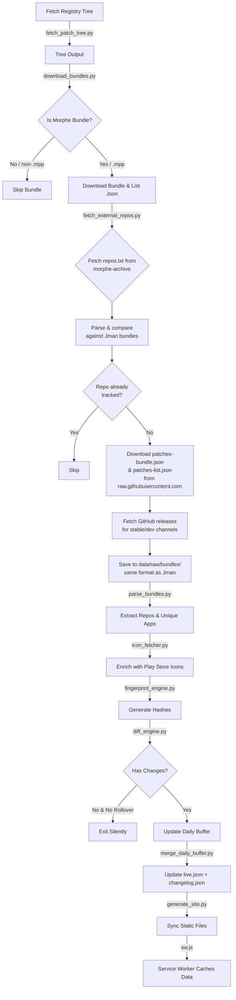

<p align="center">
  
</p>

<h1 align="center">Morphe Patch Tracker</h1>

<p align="center">
  <em>Automated compatibility, patch discovery & update monitoring for Morphe patches</em>
</p>

<p align="center">
  <a href="https://morphe-patches-drnx64.vercel.app/">
    
  </a>
  <br>
  
  
  
  
  
  
  
  
  
  
</p>

<p align="center">
  
  
  
</p>

---

## What is this?

Morphe Patch Tracker monitors the Morphe patch ecosystem — tracking **210+ patch sources** across GitHub and GitLab, detecting compatibility changes, and presenting everything in a real-time dashboard. The pipeline runs every **3 hours** via GitHub Actions, auto-discovers new patch authors, and generates a static site hosted on Vercel.

Inspired by [awesome-for-morphe](https://github.com/nvbangg/awesome-for-morphe) by [@nvbangg](https://github.com/nvbangg).

---

## Features

<table>
<tr>
<td width="50%">

### Pipeline

- **Automated Scanning** — tracks `Jman-Github/ReVanced-Patch-Bundles` registry
- **External Repo Discovery** — fetches community `repos.txt` from `rushiforai/morphe-archive`
- **GitLab & GitHub Support** — parses both seamlessly
- **Multi-channel** — `stable` and `dev` release channels
- **Smart Dedup** — hash-based fingerprints prevent redundant changes

</td>
<td width="50%">

### Dashboard

- **Dynamic Web App** — responsive dark-themed React SPA
- **App Icons** — auto-fetched from Google Play Store with persistent cache
- **Add-to-Source Links** — one-click action links into Morphe app
- **Full Changelog** — daily rollups of added, updated, removed apps
- **Offline-ready** — Service Worker with stale-while-revalidate caching

</td>
</tr>
</table>

---

## Tech Stack

<table>
<tr>
<td align="center" width="14%">
  <br>
  <strong>React 18</strong><br>
  <sub>UI Framework</sub>
</td>
<td align="center" width="14%">
  <br>
  <strong>TypeScript 5</strong><br>
  <sub>Type Safety</sub>
</td>
<td align="center" width="14%">
  <br>
  <strong>Vite 5</strong><br>
  <sub>Build Tool</sub>
</td>
<td align="center" width="14%">
  <br>
  <strong>Python 3.11</strong><br>
  <sub>Pipeline Engine</sub>
</td>
<td align="center" width="14%">
  <br>
  <strong>GitHub Actions</strong><br>
  <sub>CI/CD</sub>
</td>
<td align="center" width="14%">
  <br>
  <strong>Vercel</strong><br>
  <sub>Hosting</sub>
</td>
</tr>
</table>

---

## Quick Start

```bash
# Clone
git clone https://github.com/drnx64/morphe-track-patches.git
cd morphe-track-patches

# Install dependencies
npm install

# Start dev server (serves data/ via Vite plugin)
npm run dev

# In another terminal — run the pipeline (needs GITHUB_TOKEN)
export GITHUB_TOKEN=ghp_...
python scripts/run_pipeline.py
```

> The dev server uses a custom Vite plugin to serve `data/` files. Never use `file://` — always use `npm run dev`.

---

## How It Works

The pipeline runs every 3 hours and follows these steps:


```mermaid
graph TD
    A[Fetch Registry Tree] -->|fetch_patch_tree.py| B[Tree Output]
    B -->|download_bundles.py| C{Is Morphe Bundle?}
    C -->|No / non-.mpp| D[Skip Bundle]
    C -->|Yes / .mpp| E[Download Bundle & List Json]
    E -->|fetch_external_repos.py| E1{Fetch repos.txt from<br/>morphe-archive}
    E1 --> E2[Parse & compare<br/>against Jman bundles]
    E2 --> E3{Repo already<br/>tracked?}
    E3 -->|Yes| E4[Skip]
    E3 -->|No| E5[Download patches-bundle.json<br/>& patches-list.json<br/>from raw.githubusercontent.com]
    E5 --> E6[Fetch GitHub releases<br/>for stable/dev channels]
    E6 --> E7[Save to data/raw/bundles/<br/>same format as Jman]
    E7 -->|parse_bundles.py| F[Extract Repos & Unique Apps]
    F -->|icon_fetcher.py| G[Enrich with Play Store Icons]
    G -->|fingerprint_engine.py| H[Generate Hashes]
    H -->|diff_engine.py| I{Has Changes?}
    I -->|No & No Rollover| J[Exit Silently]
    I -->|Yes| K[Update Daily Buffer]
    K -->|merge_daily_buffer.py| L[Update live.json + changelog.json]
    L -->|generate_site.py| N[Sync Static Files]
    N -->|sw.js| O[Service Worker Caches Data]
```

### Pipeline Steps

| # | Step | Script | What it does |
|---|------|--------|-------------|
| 1 | **Discovery** | `fetch_patch_tree.py` | Crawls `Jman-Github/ReVanced-Patch-Bundles` via GitHub Git Trees API |
| 2 | **Download** | `download_bundles.py` | Filters `.mpp` bundles, downloads with skip cache + atomic swap |
| 2b | **External** | `fetch_external_repos.py` | Fetches community `repos.txt`, discovers untracked patch sources |
| 3 | **Parse** | `parse_bundles.py` | Extracts repos, apps, compatibility lists from bundles |
| 4 | **Icons** | `icon_fetcher.py` | Scrapes Google Play Store icons with persistent cache |
| 5 | **Diff** | `diff_engine.py` | SHA-256 fingerprints, detects additions/updates/removals |
| 6 | **Merge** | `merge_daily_buffer.py` | 24h change windowing, computes stats, writes `core.json` |
| 7 | **Sync** | `generate_site.py` | Preserves files across CI checkouts |

### Data Flow

```
GitHub API → download → parse → fingerprint → diff → daily buffer → JSON files → frontend
```

---

## Repository Layout

```
MorpheTracker/
├── src/                    # React frontend (TypeScript)
│   ├── components/         #   UI components
│   ├── context/            #   AppContext with useReducer
│   ├── hooks/              #   useDataFetching, useEntries
│   ├── services/           #   fetchData, iconCache, indexedDB
│   ├── types/              #   Bundle, Changes, API types
│   └── utils/              #   SVG icons, helpers
├── scripts/                # Python pipeline engine
│   ├── run_pipeline.py     #   Main orchestrator
│   ├── fetch_patch_tree.py #   Registry tree crawler
│   ├── download_bundles.py #   Bundle downloader + skip cache
│   ├── parse_bundles.py    #   Bundle parser
│   ├── icon_fetcher.py     #   Play Store icon scraper
│   ├── diff_engine.py      #   Change detection + badges
│   ├── merge_daily_buffer.py # Change windowing + stats
│   └── config.py           #   Shared constants
├── data/                   # Generated JSON (tracked)
│   ├── bundles/            #   Per-bundle metadata
│   ├── core.json           #   Aggregated app data
│   ├── changes.json        #   Latest detected changes
│   ├── stats.json          #   Global statistics
│   └── state/              #   Pipeline state (gitignored)
├── assets/                 # CSS styles (~6000 lines)
├── public/                 # Service worker, favicon, msg.txt
├── tests/                  # 30 pytest tests
├── .github/workflows/      # CI checks + auto-update pipeline
├── index.html              # Dashboard entry point
└── vercel.json             # SPA fallback routing
```

---

## Credits

<details>
<summary><strong>All Patch Authors</strong> — 210+ repos and growing</summary>

Thanks to every developer who publishes Morphe patches. The full up-to-date list is maintained in [`data/repos_list.txt`](data/repos_list.txt).

| # | Repo | Author |
|---|------|--------|
| 1 | [0-BlackSpectrum-0/channel-blacklist-patch](https://github.com/0-BlackSpectrum-0/channel-blacklist-patch) | [@0-BlackSpectrum-0](https://github.com/0-BlackSpectrum-0) |
| 2 | [6ixfalls/revanced-patches](https://github.com/6ixfalls/revanced-patches) | [@6ixfalls](https://github.com/6ixfalls) |
| 3 | [abhis1n/Morphe-Patches](https://github.com/abhis1n/Morphe-Patches) | [@abhis1n](https://github.com/abhis1n) |
| 4 | [adderalladmiral/psychonaut-wiki-journal-patches](https://github.com/adderalladmiral/psychonaut-wiki-journal-patches) | [@adderalladmiral](https://github.com/adderalladmiral) |
| 5 | [ahmedyarub/morphe-patches](https://github.com/ahmedyarub/morphe-patches) | [@ahmedyarub](https://github.com/ahmedyarub) |
| 6 | [ajstrick81/morphe-androidtv-patches](https://github.com/ajstrick81/morphe-androidtv-patches) | [@ajstrick81](https://github.com/ajstrick81) |
| 7 | [Akash-Sriram/De-Vanced](https://github.com/Akash-Sriram/De-Vanced) | [@Akash-Sriram](https://github.com/Akash-Sriram) |
| 8 | [Akash-Sriram/morphe-google-photos](https://github.com/Akash-Sriram/morphe-google-photos) | [@Akash-Sriram](https://github.com/Akash-Sriram) |
| 9 | [alalloush/xperia-1v-camera-patches](https://github.com/alalloush/xperia-1v-camera-patches) | [@alalloush](https://github.com/alalloush) |
| 10 | [alan7383/sofatime-patches](https://github.com/alan7383/sofatime-patches) | [@alan7383](https://github.com/alan7383) |
| 11 | [Alastor-Kaneki/Morphe-Patches](https://github.com/Alastor-Kaneki/Morphe-Patches) | [@Alastor-Kaneki](https://github.com/Alastor-Kaneki) |
| 12 | [AlecBlance/android-patches](https://github.com/AlecBlance/android-patches) | [@AlecBlance](https://github.com/AlecBlance) |
| 13 | [alejandrobellver/pichiwa-patches](https://github.com/alejandrobellver/pichiwa-patches) | [@alejandrobellver](https://github.com/alejandrobellver) |
| 14 | [AlexNaga/android-patches](https://github.com/AlexNaga/android-patches) | [@AlexNaga](https://github.com/AlexNaga) |
| 15 | [Almewty/my-morphe-patches](https://github.com/Almewty/my-morphe-patches) | [@Almewty](https://github.com/Almewty) |
| 16 | [ameenalasady/ameen-morphe](https://github.com/ameenalasady/ameen-morphe) | [@ameenalasady](https://github.com/ameenalasady) |
| 17 | [ameenalasady/photogrid-morphe](https://github.com/ameenalasady/photogrid-morphe) | [@ameenalasady](https://github.com/ameenalasady) |
| 18 | [Amitaisela/travian-morphe-patches](https://github.com/Amitaisela/travian-morphe-patches) | [@Amitaisela](https://github.com/Amitaisela) |
| 19 | [AmpleReVanced/revanced-patches](https://github.com/AmpleReVanced/revanced-patches) | [@AmpleReVanced](https://github.com/AmpleReVanced) |
| 20 | [anddea/revanced-patches](https://github.com/anddea/revanced-patches) | [@anddea](https://github.com/anddea) |
| 21 | [andersonlucasg3/PetalMaps-AndroidAuto](https://github.com/andersonlucasg3/PetalMaps-AndroidAuto) | [@andersonlucasg3](https://github.com/andersonlucasg3) |
| 22 | [andersonlucasg3/PetalMaps-NonHuawei](https://github.com/andersonlucasg3/PetalMaps-NonHuawei) | [@andersonlucasg3](https://github.com/andersonlucasg3) |
| 23 | [andrewliang25/morphe-patches](https://github.com/andrewliang25/morphe-patches) | [@andrewliang25](https://github.com/andrewliang25) |
| 24 | [andronedev/morphe-patches](https://github.com/andronedev/morphe-patches) | [@andronedev](https://github.com/andronedev) |
| 25 | [andronedev/morphe-portal-patch](https://github.com/andronedev/morphe-portal-patch) | [@andronedev](https://github.com/andronedev) |
| 26 | [ang3lo-azevedo/morphe-patches](https://github.com/ang3lo-azevedo/morphe-patches) | [@ang3lo-azevedo](https://github.com/ang3lo-azevedo) |
| 27 | [AngelDark92/steamlink-patches](https://github.com/AngelDark92/steamlink-patches) | [@AngelDark92](https://github.com/AngelDark92) |
| 28 | [anxyis/anxy-patches](https://github.com/anxyis/anxy-patches) | [@anxyis](https://github.com/anxyis) |
| 29 | [Apostolique/apos-morphe-patches](https://github.com/Apostolique/apos-morphe-patches) | [@Apostolique](https://github.com/Apostolique) |
| 30 | [arandomhooman/hoomans-morphe-patches](https://github.com/arandomhooman/hoomans-morphe-patches) | [@arandomhooman](https://github.com/arandomhooman) |
| 31 | [archie9211/morphe-patches](https://github.com/archie9211/morphe-patches) | [@archie9211](https://github.com/archie9211) |
| 32 | [areteruhiro/Haiagaru-Morphe](https://github.com/areteruhiro/Haiagaru-Morphe) | [@areteruhiro](https://github.com/areteruhiro) |
| 33 | [ARHCOS/arhcos-patches](https://github.com/ARHCOS/arhcos-patches) | [@ARHCOS](https://github.com/ARHCOS) |
| 34 | [ariecos/gemini-patches](https://github.com/ariecos/gemini-patches) | [@ariecos](https://github.com/ariecos) |
| 35 | [arunpdl/morphe-patches](https://github.com/arunpdl/morphe-patches) | [@arunpdl](https://github.com/arunpdl) |
| 36 | [azksama/aniskip-stremio](https://github.com/azksama/aniskip-stremio) | [@azksama](https://github.com/azksama) |
| 37 | [AzukiSensei/aniskip-stremio](https://github.com/AzukiSensei/aniskip-stremio) | [@AzukiSensei](https://github.com/AzukiSensei) |
| 38 | [babyhuehnchen/morphe-patches](https://github.com/babyhuehnchen/morphe-patches) | [@babyhuehnchen](https://github.com/babyhuehnchen) |
| 39 | [bdgerszewski/morphe-patches-ihealth](https://github.com/bdgerszewski/morphe-patches-ihealth) | [@bdgerszewski](https://github.com/bdgerszewski) |
| 40 | [benzophury/oraimo-health-morphe-patches](https://github.com/benzophury/oraimo-health-morphe-patches) | [@benzophury](https://github.com/benzophury) |
| 41 | [bernardo7894/remove-permaban-banner-patch](https://github.com/bernardo7894/remove-permaban-banner-patch) | [@bernardo7894](https://github.com/bernardo7894) |
| 42 | [BholeyKaBhakt/android-patches-xtra](https://github.com/BholeyKaBhakt/android-patches-xtra) | [@BholeyKaBhakt](https://github.com/BholeyKaBhakt) |
| 43 | [bigyank/morphe-patches-samsung](https://github.com/bigyank/morphe-patches-samsung) | [@bigyank](https://github.com/bigyank) |
| 44 | [binarymend/morphe-patches](https://github.com/binarymend/morphe-patches) | [@binarymend](https://github.com/binarymend) |
| 45 | [BlazeFTL/FTL-Patches](https://github.com/BlazeFTL/FTL-Patches) | [@BlazeFTL](https://github.com/BlazeFTL) |
| 46 | [BlazeFTL/Morphe-Portal-Patches-New](https://github.com/BlazeFTL/Morphe-Portal-Patches-New) | [@BlazeFTL](https://github.com/BlazeFTL) |
| 47 | [BlueDragon4251/tiktok-patches-for-morphe](https://github.com/BlueDragon4251/tiktok-patches-for-morphe) | [@BlueDragon4251](https://github.com/BlueDragon4251) |
| 48 | [braiNtropy/braintropy-patches](https://github.com/braiNtropy/braintropy-patches) | [@braiNtropy](https://github.com/braiNtropy) |
| 49 | [brosssh/morphe-patches](https://github.com/brosssh/morphe-patches) | [@brosssh](https://github.com/brosssh) |
| 50 | [browzomje/browzomje-patches](https://github.com/browzomje/browzomje-patches) | [@browzomje](https://github.com/browzomje) |
| 51 | [bruddaa/bruddas-morphe-patches](https://github.com/bruddaa/bruddas-morphe-patches) | [@bruddaa](https://github.com/bruddaa) |
| 52 | [bufferk/morphe-patches](https://github.com/bufferk/morphe-patches) | [@bufferk](https://github.com/bufferk) |
| 53 | [Burhanverse/test](https://github.com/Burhanverse/test) | [@Burhanverse](https://github.com/Burhanverse) |
| 54 | [byehi98/okish-morphe-patches](https://github.com/byehi98/okish-morphe-patches) | [@byehi98](https://github.com/byehi98) |
| 55 | [canh0chua/Morphe-patches](https://github.com/canh0chua/Morphe-patches) | [@canh0chua](https://github.com/canh0chua) |
| 56 | [catsmoker/anime-witcher-patches](https://github.com/catsmoker/anime-witcher-patches) | [@catsmoker](https://github.com/catsmoker) |
| 57 | [cesbar/zpatches](https://github.com/cesbar/zpatches) | [@cesbar](https://github.com/cesbar) |
| 58 | [ch3thanhs/stylus](https://github.com/ch3thanhs/stylus) | [@ch3thanhs](https://github.com/ch3thanhs) |
| 59 | [chicco-carone/morphe-patches-chicco](https://github.com/chicco-carone/morphe-patches-chicco) | [@chicco-carone](https://github.com/chicco-carone) |
| 60 | [chirag127/morphe-patches](https://github.com/chirag127/morphe-patches) | [@chirag127](https://github.com/chirag127) |
| 61 | [chukfinley/tidal-patches](https://github.com/chukfinley/tidal-patches) | [@chukfinley](https://github.com/chukfinley) |
| 62 | [ciraolone/morphe-watch-later](https://github.com/ciraolone/morphe-watch-later) | [@ciraolone](https://github.com/ciraolone) |
| 63 | [claviola/morphe-patches-nl](https://github.com/claviola/morphe-patches-nl) | [@claviola](https://github.com/claviola) |
| 64 | [crimera/piko](https://github.com/crimera/piko) | [@crimera](https://github.com/crimera) |
| 65 | [crimera/piko-newx](https://github.com/crimera/piko-newx) | [@crimera](https://github.com/crimera) |
| 66 | [csagataj2/morphe-patches](https://github.com/csagataj2/morphe-patches) | [@csagataj2](https://github.com/csagataj2) |
| 67 | [d0nj/morphe-patches](https://github.com/d0nj/morphe-patches) | [@d0nj](https://github.com/d0nj) |
| 68 | [Dan1elTheMan1el/Morphe-Patches](https://github.com/Dan1elTheMan1el/Morphe-Patches) | [@Dan1elTheMan1el](https://github.com/Dan1elTheMan1el) |
| 69 | [DarioDKM/ringconn-patches](https://github.com/DarioDKM/ringconn-patches) | [@DarioDKM](https://github.com/DarioDKM) |
| 70 | [david419kr/niconico-yt-morphe-patches](https://github.com/david419kr/niconico-yt-morphe-patches) | [@david419kr](https://github.com/david419kr) |
| 71 | [debakarr/morphe-patches](https://github.com/debakarr/morphe-patches) | [@debakarr](https://github.com/debakarr) |
| 72 | [dexnis-dev/morphe-patches](https://github.com/dexnis-dev/morphe-patches) | [@dexnis-dev](https://github.com/dexnis-dev) |
| 73 | [dh6k/morphe-patches](https://github.com/dh6k/morphe-patches) | [@dh6k](https://github.com/dh6k) |
| 74 | [dhrubonai/morphe-patches](https://github.com/dhrubonai/morphe-patches) | [@dhrubonai](https://github.com/dhrubonai) |
| 75 | [docbt/patched-up](https://github.com/docbt/patched-up) | [@docbt](https://github.com/docbt) |
| 76 | [Dr4w/morphe-patches](https://github.com/Dr4w/morphe-patches) | [@Dr4w](https://github.com/Dr4w) |
| 77 | [drnhzn/supreme-patches](https://github.com/drnhzn/supreme-patches) | [@drnhzn](https://github.com/drnhzn) |
| 78 | [drosoCode/morphe-patches](https://github.com/drosoCode/morphe-patches) | [@drosoCode](https://github.com/drosoCode) |
| 79 | [dumb-software/T2C-App-Patch-Morphe](https://github.com/dumb-software/T2C-App-Patch-Morphe) | [@dumb-software](https://github.com/dumb-software) |
| 80 | [dumketo/multi-app-patches](https://github.com/dumketo/multi-app-patches) | [@dumketo](https://github.com/dumketo) |
| 81 | [durgesh0505/chiggi_morphe_patches](https://github.com/durgesh0505/chiggi_morphe_patches) | [@durgesh0505](https://github.com/durgesh0505) |
| 82 | [Educal72/educal-patches](https://github.com/Educal72/educal-patches) | [@Educal72](https://github.com/Educal72) |
| 83 | [electiveDev/tiaruebar-patches-vip-fix](https://github.com/electiveDev/tiaruebar-patches-vip-fix) | [@electiveDev](https://github.com/electiveDev) |
| 84 | [enccmp/mn-patches](https://github.com/enccmp/mn-patches) | [@enccmp](https://github.com/enccmp) |
| 85 | [Entree3k/Morning-Entree-Patches](https://github.com/Entree3k/Morning-Entree-Patches) | [@Entree3k](https://github.com/Entree3k) |
| 86 | [Epxec/android-patches](https://github.com/Epxec/android-patches) | [@Epxec](https://github.com/Epxec) |
| 87 | [ethanm6/letterboxd-stremio-morphe-patch](https://github.com/ethanm6/letterboxd-stremio-morphe-patch) | [@ethanm6](https://github.com/ethanm6) |
| 88 | [eyalm2000/tidal-debug-menu](https://github.com/eyalm2000/tidal-debug-menu) | [@eyalm2000](https://github.com/eyalm2000) |
| 89 | [eZ4RK0/morphe-patches](https://github.com/eZ4RK0/morphe-patches) | [@eZ4RK0](https://github.com/eZ4RK0) |
| 90 | [fangkampanat/gmaps-patches](https://github.com/fangkampanat/gmaps-patches) | [@fangkampanat](https://github.com/fangkampanat) |
| 91 | [FoxxoOwO/foxxo-patches](https://github.com/FoxxoOwO/foxxo-patches) | [@FoxxoOwO](https://github.com/FoxxoOwO) |
| 92 | [franticg33k/morphe-patches](https://github.com/franticg33k/morphe-patches) | [@franticg33k](https://github.com/franticg33k) |
| 93 | [Freeman022026/rustore-privacy-patches](https://github.com/Freeman022026/rustore-privacy-patches) | [@Freeman022026](https://github.com/Freeman022026) |
| 94 | [Fripe070/PixivPatches](https://github.com/Fripe070/PixivPatches) | [@Fripe070](https://github.com/Fripe070) |
| 95 | [furkngld/tiktok-lite-patches-for-morphe](https://github.com/furkngld/tiktok-lite-patches-for-morphe) | [@furkngld](https://github.com/furkngld) |
| 96 | [gitlab.com/early.egg3707](https://github.com/gitlab.com/early.egg3707) | [@gitlab.com](https://github.com/gitlab.com) |
| 97 | [gitlab.com/IMXEren](https://github.com/gitlab.com/IMXEren) | [@gitlab.com](https://github.com/gitlab.com) |
| 98 | [gitlab.com/inotia00](https://github.com/gitlab.com/inotia00) | [@gitlab.com](https://github.com/gitlab.com) |
| 99 | [gitlab.com/inotia00](https://github.com/gitlab.com/inotia00) | [@gitlab.com](https://github.com/gitlab.com) |
| 100 | [gitlab.com/Paresh-Maheshwari](https://github.com/gitlab.com/Paresh-Maheshwari) | [@gitlab.com](https://github.com/gitlab.com) |
| 101 | [GoldRift/morphe-patches](https://github.com/GoldRift/morphe-patches) | [@GoldRift](https://github.com/GoldRift) |
| 102 | [Graywizard888/Enhancify](https://github.com/Graywizard888/Enhancify) | [@Graywizard888](https://github.com/Graywizard888) |
| 103 | [hackingguy/morphe-patches](https://github.com/hackingguy/morphe-patches) | [@hackingguy](https://github.com/hackingguy) |
| 104 | [Hari-sys786/telegram-patches](https://github.com/Hari-sys786/telegram-patches) | [@Hari-sys786](https://github.com/Hari-sys786) |
| 105 | [hashtagbasit/aimal-patches](https://github.com/hashtagbasit/aimal-patches) | [@hashtagbasit](https://github.com/hashtagbasit) |
| 106 | [heinrich26/morphe-patches](https://github.com/heinrich26/morphe-patches) | [@heinrich26](https://github.com/heinrich26) |
| 107 | [HelioFloxZ/HelioFloxZ-Patches](https://github.com/HelioFloxZ/HelioFloxZ-Patches) | [@HelioFloxZ](https://github.com/HelioFloxZ) |
| 108 | [HelioFloxZ/YouTube-Studio-Patches](https://github.com/HelioFloxZ/YouTube-Studio-Patches) | [@HelioFloxZ](https://github.com/HelioFloxZ) |
| 109 | [HellveticaStandard/HellveticaPatches](https://github.com/HellveticaStandard/HellveticaPatches) | [@HellveticaStandard](https://github.com/HellveticaStandard) |
| 110 | [heval99/Heval-Morphe-Patches](https://github.com/heval99/Heval-Morphe-Patches) | [@heval99](https://github.com/heval99) |
| 111 | [heval99/morphe-patches](https://github.com/heval99/morphe-patches) | [@heval99](https://github.com/heval99) |
| 112 | [hhawkinsau/hh-patches](https://github.com/hhawkinsau/hh-patches) | [@hhawkinsau](https://github.com/hhawkinsau) |
| 113 | [Hiosdra/morphe-patches](https://github.com/Hiosdra/morphe-patches) | [@Hiosdra](https://github.com/Hiosdra) |
| 114 | [homelander11/beetle-patches](https://github.com/homelander11/beetle-patches) | [@homelander11](https://github.com/homelander11) |
| 115 | [hoo-dles/jadx-morphe](https://github.com/hoo-dles/jadx-morphe) | [@hoo-dles](https://github.com/hoo-dles) |
| 116 | [hoo-dles/morphe-patches](https://github.com/hoo-dles/morphe-patches) | [@hoo-dles](https://github.com/hoo-dles) |
| 117 | [HSlightsteel/slight-patches](https://github.com/HSlightsteel/slight-patches) | [@HSlightsteel](https://github.com/HSlightsteel) |
| 118 | [hu-liberator/patches](https://github.com/hu-liberator/patches) | [@hu-liberator](https://github.com/hu-liberator) |
| 119 | [humzakh/HK-Morphe-Patches](https://github.com/humzakh/HK-Morphe-Patches) | [@humzakh](https://github.com/humzakh) |
| 120 | [HvQ/eksi-morphe](https://github.com/HvQ/eksi-morphe) | [@HvQ](https://github.com/HvQ) |
| 121 | [hxreborn/hxreborn-tiktok-patches](https://github.com/hxreborn/hxreborn-tiktok-patches) | [@hxreborn](https://github.com/hxreborn) |
| 122 | [hxreborn/morphe-patches](https://github.com/hxreborn/morphe-patches) | [@hxreborn](https://github.com/hxreborn) |
| 123 | [icysymmetra/tiktok-patches-for-morphe](https://github.com/icysymmetra/tiktok-patches-for-morphe) | [@icysymmetra](https://github.com/icysymmetra) |
| 124 | [Ikuradachi/ikura-patches](https://github.com/Ikuradachi/ikura-patches) | [@Ikuradachi](https://github.com/Ikuradachi) |
| 125 | [ilikeadofai/vocacolle-morphe-patches](https://github.com/ilikeadofai/vocacolle-morphe-patches) | [@ilikeadofai](https://github.com/ilikeadofai) |
| 126 | [ImmortalZeus/ImmortalZeus-Morphe-Patches](https://github.com/ImmortalZeus/ImmortalZeus-Morphe-Patches) | [@ImmortalZeus](https://github.com/ImmortalZeus) |
| 127 | [ImNoammm/morphe-spotify-patches](https://github.com/ImNoammm/morphe-spotify-patches) | [@ImNoammm](https://github.com/ImNoammm) |
| 128 | [IMXEren/mix-patches](https://github.com/IMXEren/mix-patches) | [@IMXEren](https://github.com/IMXEren) |
| 129 | [Insane96/Pinterest-patch](https://github.com/Insane96/Pinterest-patch) | [@Insane96](https://github.com/Insane96) |
| 130 | [ispacecase/patchweaver](https://github.com/ispacecase/patchweaver) | [@ispacecase](https://github.com/ispacecase) |
| 131 | [isuruhg/cricinfo-tweaks](https://github.com/isuruhg/cricinfo-tweaks) | [@isuruhg](https://github.com/isuruhg) |
| 132 | [isuruhg/fin-tweaks](https://github.com/isuruhg/fin-tweaks) | [@isuruhg](https://github.com/isuruhg) |
| 133 | [itsthejoker/itsthejoker-patches](https://github.com/itsthejoker/itsthejoker-patches) | [@itsthejoker](https://github.com/itsthejoker) |
| 134 | [jackblk/morphe-patches](https://github.com/jackblk/morphe-patches) | [@jackblk](https://github.com/jackblk) |
| 135 | [JacobPlaysGames/CrimeRadar-Morphe-Patches](https://github.com/JacobPlaysGames/CrimeRadar-Morphe-Patches) | [@JacobPlaysGames](https://github.com/JacobPlaysGames) |
| 136 | [jancerny2001/morphe-patches](https://github.com/jancerny2001/morphe-patches) | [@jancerny2001](https://github.com/jancerny2001) |
| 137 | [jaredcat/morphe-patches](https://github.com/jaredcat/morphe-patches) | [@jaredcat](https://github.com/jaredcat) |
| 138 | [jasonwu1994/Gboard-patches](https://github.com/jasonwu1994/Gboard-patches) | [@jasonwu1994](https://github.com/jasonwu1994) |
| 139 | [jkennethcarino/adobo](https://github.com/jkennethcarino/adobo) | [@jkennethcarino](https://github.com/jkennethcarino) |
| 140 | [Jl4cTuk/morphe-patches](https://github.com/Jl4cTuk/morphe-patches) | [@Jl4cTuk](https://github.com/Jl4cTuk) |
| 141 | [Jman-Github/Awesome-ReVanced](https://github.com/Jman-Github/Awesome-ReVanced) | [@Jman-Github](https://github.com/Jman-Github) |
| 142 | [Jman-Github/ReVanced-Patch-Bundles](https://github.com/Jman-Github/ReVanced-Patch-Bundles) | [@Jman-Github](https://github.com/Jman-Github) |
| 143 | [Jman-Github/Universal-ReVanced-Manager](https://github.com/Jman-Github/Universal-ReVanced-Manager) | [@Jman-Github](https://github.com/Jman-Github) |
| 144 | [Joristdh/Platypatch](https://github.com/Joristdh/Platypatch) | [@Joristdh](https://github.com/Joristdh) |
| 145 | [Joussflls10/Jouss-Patches](https://github.com/Joussflls10/Jouss-Patches) | [@Joussflls10](https://github.com/Joussflls10) |
| 146 | [jrddupont/discord-patches](https://github.com/jrddupont/discord-patches) | [@jrddupont](https://github.com/jrddupont) |
| 147 | [JZ6/Flexboard](https://github.com/JZ6/Flexboard) | [@JZ6](https://github.com/JZ6) |
| 148 | [kanup4m/morphe-patches](https://github.com/kanup4m/morphe-patches) | [@kanup4m](https://github.com/kanup4m) |
| 149 | [kareemlukitomo/morphe-patches](https://github.com/kareemlukitomo/morphe-patches) | [@kareemlukitomo](https://github.com/kareemlukitomo) |
| 150 | [Kecerim24/morphe-patches](https://github.com/Kecerim24/morphe-patches) | [@Kecerim24](https://github.com/Kecerim24) |
| 151 | [kiraio-moe/Lain-Patches](https://github.com/kiraio-moe/Lain-Patches) | [@kiraio-moe](https://github.com/kiraio-moe) |
| 152 | [kolaron/morphe-patches](https://github.com/kolaron/morphe-patches) | [@kolaron](https://github.com/kolaron) |
| 153 | [kondratjev/morphe-patches](https://github.com/kondratjev/morphe-patches) | [@kondratjev](https://github.com/kondratjev) |
| 154 | [kontsevoye/emorphe-patches](https://github.com/kontsevoye/emorphe-patches) | [@kontsevoye](https://github.com/kontsevoye) |
| 155 | [kuchingneko28/ipusnas-patches](https://github.com/kuchingneko28/ipusnas-patches) | [@kuchingneko28](https://github.com/kuchingneko28) |
| 156 | [kun-codes/npci-bhim-morphe-patches](https://github.com/kun-codes/npci-bhim-morphe-patches) | [@kun-codes](https://github.com/kun-codes) |
| 157 | [kuntal-devrat/diskwala-patches](https://github.com/kuntal-devrat/diskwala-patches) | [@kuntal-devrat](https://github.com/kuntal-devrat) |
| 158 | [kveld9/kveld-morphe-patches](https://github.com/kveld9/kveld-morphe-patches) | [@kveld9](https://github.com/kveld9) |
| 159 | [LaBlazer/morphe-patches](https://github.com/LaBlazer/morphe-patches) | [@LaBlazer](https://github.com/LaBlazer) |
| 160 | [LaKakaReal/LaKakaShitPatches](https://github.com/LaKakaReal/LaKakaShitPatches) | [@LaKakaReal](https://github.com/LaKakaReal) |
| 161 | [legendsciber/morphe-patches](https://github.com/legendsciber/morphe-patches) | [@legendsciber](https://github.com/legendsciber) |
| 162 | [LimeLimes/cbc-patches](https://github.com/LimeLimes/cbc-patches) | [@LimeLimes](https://github.com/LimeLimes) |
| 163 | [liongalahad/liongalahad-nuviotv-morphe-patches](https://github.com/liongalahad/liongalahad-nuviotv-morphe-patches) | [@liongalahad](https://github.com/liongalahad) |
| 164 | [liongalahad/liongalahad-stremio-morphe-patches](https://github.com/liongalahad/liongalahad-stremio-morphe-patches) | [@liongalahad](https://github.com/liongalahad) |
| 165 | [liongalahad/nuviotv-morphe-patches](https://github.com/liongalahad/nuviotv-morphe-patches) | [@liongalahad](https://github.com/liongalahad) |
| 166 | [liongalahad/nuviotv-patches](https://github.com/liongalahad/nuviotv-patches) | [@liongalahad](https://github.com/liongalahad) |
| 167 | [liongalahad/stremio-androidTV-morphe-patches](https://github.com/liongalahad/stremio-androidTV-morphe-patches) | [@liongalahad](https://github.com/liongalahad) |
| 168 | [LOCKhart07/morphe-patches](https://github.com/LOCKhart07/morphe-patches) | [@LOCKhart07](https://github.com/LOCKhart07) |
| 169 | [logm1lo/logm1lo-patches](https://github.com/logm1lo/logm1lo-patches) | [@logm1lo](https://github.com/logm1lo) |
| 170 | [lootdev78/psylos-morphe-patches](https://github.com/lootdev78/psylos-morphe-patches) | [@lootdev78](https://github.com/lootdev78) |
| 171 | [loskutov/youtube-domain-fronting-patch](https://github.com/loskutov/youtube-domain-fronting-patch) | [@loskutov](https://github.com/loskutov) |
| 172 | [Lynx6319/patch-youtube-scroll-block](https://github.com/Lynx6319/patch-youtube-scroll-block) | [@Lynx6319](https://github.com/Lynx6319) |
| 173 | [lyyako/realme-link-patches](https://github.com/lyyako/realme-link-patches) | [@lyyako](https://github.com/lyyako) |
| 174 | [madhu-gowda6/atharv-patches](https://github.com/madhu-gowda6/atharv-patches) | [@madhu-gowda6](https://github.com/madhu-gowda6) |
| 175 | [MarcaDian/morphe-patches-yavot](https://github.com/MarcaDian/morphe-patches-yavot) | [@MarcaDian](https://github.com/MarcaDian) |
| 176 | [MauroGamerVN/Morphe-Patches](https://github.com/MauroGamerVN/Morphe-Patches) | [@MauroGamerVN](https://github.com/MauroGamerVN) |
| 177 | [meridianfresco/morphe-meta-patches](https://github.com/meridianfresco/morphe-meta-patches) | [@meridianfresco](https://github.com/meridianfresco) |
| 178 | [MiguelNinja19/miguel-morphe-patches](https://github.com/MiguelNinja19/miguel-morphe-patches) | [@MiguelNinja19](https://github.com/MiguelNinja19) |
| 179 | [miketweaver/friendsturner-patches](https://github.com/miketweaver/friendsturner-patches) | [@miketweaver](https://github.com/miketweaver) |
| 180 | [MohamedElnaggar00/morphe-patches-tiktok-lite-only](https://github.com/MohamedElnaggar00/morphe-patches-tiktok-lite-only) | [@MohamedElnaggar00](https://github.com/MohamedElnaggar00) |
| 181 | [MoonShadowKeeper/Telegram-patchesMorphe](https://github.com/MoonShadowKeeper/Telegram-patchesMorphe) | [@MoonShadowKeeper](https://github.com/MoonShadowKeeper) |
| 182 | [MorpheApp/morphe-patches](https://github.com/MorpheApp/morphe-patches) | [@MorpheApp](https://github.com/MorpheApp) |
| 183 | [mvaishak/letterboxd-morphe-patches](https://github.com/mvaishak/letterboxd-morphe-patches) | [@mvaishak](https://github.com/mvaishak) |
| 184 | [mxkrgt/dbtcoach-morphe-patches](https://github.com/mxkrgt/dbtcoach-morphe-patches) | [@mxkrgt](https://github.com/mxkrgt) |
| 185 | [Nagol12344/patch](https://github.com/Nagol12344/patch) | [@Nagol12344](https://github.com/Nagol12344) |
| 186 | [Nai64/Nai64Patches](https://github.com/Nai64/Nai64Patches) | [@Nai64](https://github.com/Nai64) |
| 187 | [NekoGryphou/gryphous-morphe-patches](https://github.com/NekoGryphou/gryphous-morphe-patches) | [@NekoGryphou](https://github.com/NekoGryphou) |
| 188 | [Nerahikada/asken-patches](https://github.com/Nerahikada/asken-patches) | [@Nerahikada](https://github.com/Nerahikada) |
| 189 | [nosini/disable-shorts-repeat](https://github.com/nosini/disable-shorts-repeat) | [@nosini](https://github.com/nosini) |
| 190 | [NullWaypoint/morphe-patches](https://github.com/NullWaypoint/morphe-patches) | [@NullWaypoint](https://github.com/NullWaypoint) |
| 191 | [nvbangg/builder-for-morphe](https://github.com/nvbangg/builder-for-morphe) | [@nvbangg](https://github.com/nvbangg) |
| 192 | [Okazakee/iptv-morphe-patches](https://github.com/Okazakee/iptv-morphe-patches) | [@Okazakee](https://github.com/Okazakee) |
| 193 | [osirisad/teamsnap-patches](https://github.com/osirisad/teamsnap-patches) | [@osirisad](https://github.com/osirisad) |
| 194 | [osirisad/ts-patches](https://github.com/osirisad/ts-patches) | [@osirisad](https://github.com/osirisad) |
| 195 | [ozeroztas/Morphe-Patch](https://github.com/ozeroztas/Morphe-Patch) | [@ozeroztas](https://github.com/ozeroztas) |
| 196 | [Pa-kon/morphe-screenshot-patches](https://github.com/Pa-kon/morphe-screenshot-patches) | [@Pa-kon](https://github.com/Pa-kon) |
| 197 | [Paresh-Maheshwari/patch-explorer](https://github.com/Paresh-Maheshwari/patch-explorer) | [@Paresh-Maheshwari](https://github.com/Paresh-Maheshwari) |
| 198 | [PawiX25/pepper-morphe-patches](https://github.com/PawiX25/pepper-morphe-patches) | [@PawiX25](https://github.com/PawiX25) |
| 199 | [picarica/My-moprhe-patches](https://github.com/picarica/My-moprhe-patches) | [@picarica](https://github.com/picarica) |
| 200 | [PixelPusher247/morphe-patches](https://github.com/PixelPusher247/morphe-patches) | [@PixelPusher247](https://github.com/PixelPusher247) |
| 201 | [pmaxhogan/vantage-patches](https://github.com/pmaxhogan/vantage-patches) | [@pmaxhogan](https://github.com/pmaxhogan) |
| 202 | [polka-bear/morphe-patches](https://github.com/polka-bear/morphe-patches) | [@polka-bear](https://github.com/polka-bear) |
| 203 | [PrathxmOp/Prathxm-Patches](https://github.com/PrathxmOp/Prathxm-Patches) | [@PrathxmOp](https://github.com/PrathxmOp) |
| 204 | [PrathxmOp/ytmusic-patches](https://github.com/PrathxmOp/ytmusic-patches) | [@PrathxmOp](https://github.com/PrathxmOp) |
| 205 | [pseudofractal/morphe-patches](https://github.com/pseudofractal/morphe-patches) | [@pseudofractal](https://github.com/pseudofractal) |
| 206 | [PyFlat-JR/Morphe-Patches](https://github.com/PyFlat-JR/Morphe-Patches) | [@PyFlat-JR](https://github.com/PyFlat-JR) |
| 207 | [quantavil/edge-morphe-patches](https://github.com/quantavil/edge-morphe-patches) | [@quantavil](https://github.com/quantavil) |
| 208 | [Quantro100/Morphe-patches](https://github.com/Quantro100/Morphe-patches) | [@Quantro100](https://github.com/Quantro100) |
| 209 | [RabehX/rabehx-patches](https://github.com/RabehX/rabehx-patches) | [@RabehX](https://github.com/RabehX) |
| 210 | [rafag00/morphe-patches](https://github.com/rafag00/morphe-patches) | [@rafag00](https://github.com/rafag00) |
| 211 | [rahul9999xda/telegram-morphe-patches](https://github.com/rahul9999xda/telegram-morphe-patches) | [@rahul9999xda](https://github.com/rahul9999xda) |
| 212 | [RealCyberwash/max-patches](https://github.com/RealCyberwash/max-patches) | [@RealCyberwash](https://github.com/RealCyberwash) |
| 213 | [rhubarbshoelaces/morphe-patches](https://github.com/rhubarbshoelaces/morphe-patches) | [@rhubarbshoelaces](https://github.com/rhubarbshoelaces) |
| 214 | [riky-dev/morphe-patches](https://github.com/riky-dev/morphe-patches) | [@riky-dev](https://github.com/riky-dev) |
| 215 | [Ripthulhu/morphe-google-patches](https://github.com/Ripthulhu/morphe-google-patches) | [@Ripthulhu](https://github.com/Ripthulhu) |
| 216 | [RjBiermann/brave-waffle](https://github.com/RjBiermann/brave-waffle) | [@RjBiermann](https://github.com/RjBiermann) |
| 217 | [RookieEnough/De-Vanced](https://github.com/RookieEnough/De-Vanced) | [@RookieEnough](https://github.com/RookieEnough) |
| 218 | [RoundSalmon4/morphe-patches-template](https://github.com/RoundSalmon4/morphe-patches-template) | [@RoundSalmon4](https://github.com/RoundSalmon4) |
| 219 | [rushiranpise/RI-Vanced-Universal-Morphe-Patches](https://github.com/rushiranpise/RI-Vanced-Universal-Morphe-Patches) | [@rushiranpise](https://github.com/rushiranpise) |
| 220 | [rushiranpise/Ri-Vanced-Universal-Morphe-Patches](https://github.com/rushiranpise/Ri-Vanced-Universal-Morphe-Patches) | [@rushiranpise](https://github.com/rushiranpise) |
| 221 | [ryuya0124/gemini-microg-patches](https://github.com/ryuya0124/gemini-microg-patches) | [@ryuya0124](https://github.com/ryuya0124) |
| 222 | [saieshshirodkar/saiesh-morphe-patches](https://github.com/saieshshirodkar/saiesh-morphe-patches) | [@saieshshirodkar](https://github.com/saieshshirodkar) |
| 223 | [Santodan/santodan-patches](https://github.com/Santodan/santodan-patches) | [@Santodan](https://github.com/Santodan) |
| 224 | [SapitoSucio/FroggoMorphePatches](https://github.com/SapitoSucio/FroggoMorphePatches) | [@SapitoSucio](https://github.com/SapitoSucio) |
| 225 | [sashade8-ship-it/dual-vot-patches](https://github.com/sashade8-ship-it/dual-vot-patches) | [@sashade8-ship-it](https://github.com/sashade8-ship-it) |
| 226 | [SatanMerde/D-moniakPatches](https://github.com/SatanMerde/D-moniakPatches) | [@SatanMerde](https://github.com/SatanMerde) |
| 227 | [Seobject/Seobject-patches](https://github.com/Seobject/Seobject-patches) | [@Seobject](https://github.com/Seobject) |
| 228 | [Sfehhrths/ekispert-morphe-patches](https://github.com/Sfehhrths/ekispert-morphe-patches) | [@Sfehhrths](https://github.com/Sfehhrths) |
| 229 | [shaun-the-sheep-patches/morphe-patches](https://github.com/shaun-the-sheep-patches/morphe-patches) | [@shaun-the-sheep-patches](https://github.com/shaun-the-sheep-patches) |
| 230 | [ShuhaibNC/morphe-patches](https://github.com/ShuhaibNC/morphe-patches) | [@ShuhaibNC](https://github.com/ShuhaibNC) |
| 231 | [sjshb57/Pairip-Patches](https://github.com/sjshb57/Pairip-Patches) | [@sjshb57](https://github.com/sjshb57) |
| 232 | [skulldogged/cobalt-morphe](https://github.com/skulldogged/cobalt-morphe) | [@skulldogged](https://github.com/skulldogged) |
| 233 | [SouBryan/pinterest-morphed](https://github.com/SouBryan/pinterest-morphed) | [@SouBryan](https://github.com/SouBryan) |
| 234 | [spicetify/morphe-patches](https://github.com/spicetify/morphe-patches) | [@spicetify](https://github.com/spicetify) |
| 235 | [spookyexe/morphe-patches](https://github.com/spookyexe/morphe-patches) | [@spookyexe](https://github.com/spookyexe) |
| 236 | [subenoeva/roadsync-patches](https://github.com/subenoeva/roadsync-patches) | [@subenoeva](https://github.com/subenoeva) |
| 237 | [sushruth/imgur-patches](https://github.com/sushruth/imgur-patches) | [@sushruth](https://github.com/sushruth) |
| 238 | [SysAdminDoc/hushfeed](https://github.com/SysAdminDoc/hushfeed) | [@SysAdminDoc](https://github.com/SysAdminDoc) |
| 239 | [tadikwa/google-clock-morphe-patches](https://github.com/tadikwa/google-clock-morphe-patches) | [@tadikwa](https://github.com/tadikwa) |
| 240 | [theabhishekbhujang/morphe-patches](https://github.com/theabhishekbhujang/morphe-patches) | [@theabhishekbhujang](https://github.com/theabhishekbhujang) |
| 241 | [thejaustin/smartlauncher-morphe-patches](https://github.com/thejaustin/smartlauncher-morphe-patches) | [@thejaustin](https://github.com/thejaustin) |
| 242 | [TheRealCrazyfuy/abeja-morphe-patches](https://github.com/TheRealCrazyfuy/abeja-morphe-patches) | [@TheRealCrazyfuy](https://github.com/TheRealCrazyfuy) |
| 243 | [TheRealSkywarp/morphe-patches](https://github.com/TheRealSkywarp/morphe-patches) | [@TheRealSkywarp](https://github.com/TheRealSkywarp) |
| 244 | [thrkingunknown/gboard-theme-patch](https://github.com/thrkingunknown/gboard-theme-patch) | [@thrkingunknown](https://github.com/thrkingunknown) |
| 245 | [tiaruebar1024/tiaruebar-patches](https://github.com/tiaruebar1024/tiaruebar-patches) | [@tiaruebar1024](https://github.com/tiaruebar1024) |
| 246 | [timpra/a17](https://github.com/timpra/a17) | [@timpra](https://github.com/timpra) |
| 247 | [Tornillo2/movistar-block-ads-morphe](https://github.com/Tornillo2/movistar-block-ads-morphe) | [@Tornillo2](https://github.com/Tornillo2) |
| 248 | [totsiaw/proxma-patches](https://github.com/totsiaw/proxma-patches) | [@totsiaw](https://github.com/totsiaw) |
| 249 | [Trimpsuz/morphe-busuu](https://github.com/Trimpsuz/morphe-busuu) | [@Trimpsuz](https://github.com/Trimpsuz) |
| 250 | [Utsavrajputt/Modx-patches](https://github.com/Utsavrajputt/Modx-patches) | [@Utsavrajputt](https://github.com/Utsavrajputt) |
| 251 | [V4n1X/morphe-patches](https://github.com/V4n1X/morphe-patches) | [@V4n1X](https://github.com/V4n1X) |
| 252 | [variablenine/morphe-patches](https://github.com/variablenine/morphe-patches) | [@variablenine](https://github.com/variablenine) |
| 253 | [vladon/morphe-patches-navi](https://github.com/vladon/morphe-patches-navi) | [@vladon](https://github.com/vladon) |
| 254 | [vomw/morphe-patches](https://github.com/vomw/morphe-patches) | [@vomw](https://github.com/vomw) |
| 255 | [WalkTheEarth/morphe-ytvr-patches](https://github.com/WalkTheEarth/morphe-ytvr-patches) | [@WalkTheEarth](https://github.com/WalkTheEarth) |
| 256 | [wchill/anddea-rvx-morphed](https://github.com/wchill/anddea-rvx-morphed) | [@wchill](https://github.com/wchill) |
| 257 | [wchill/patcheddit](https://github.com/wchill/patcheddit) | [@wchill](https://github.com/wchill) |
| 258 | [wchill/rvx-morphed](https://github.com/wchill/rvx-morphed) | [@wchill](https://github.com/wchill) |
| 259 | [WZSE/aapam-patches](https://github.com/WZSE/aapam-patches) | [@WZSE](https://github.com/WZSE) |
| 260 | [WZSE/morphe-patches](https://github.com/WZSE/morphe-patches) | [@WZSE](https://github.com/WZSE) |
| 261 | [Xhehab/Xhehab-Patches](https://github.com/Xhehab/Xhehab-Patches) | [@Xhehab](https://github.com/Xhehab) |
| 262 | [Xisrr1/Revancify-Xisr](https://github.com/Xisrr1/Revancify-Xisr) | [@Xisrr1](https://github.com/Xisrr1) |
| 263 | [xob0t/morphe-patches](https://github.com/xob0t/morphe-patches) | [@xob0t](https://github.com/xob0t) |
| 264 | [XTapped/morphe-patches](https://github.com/XTapped/morphe-patches) | [@XTapped](https://github.com/XTapped) |
| 265 | [yann-soliman/morphe-patches](https://github.com/yann-soliman/morphe-patches) | [@yann-soliman](https://github.com/yann-soliman) |
| 266 | [ynotzort/morphe-patches](https://github.com/ynotzort/morphe-patches) | [@ynotzort](https://github.com/ynotzort) |
| 267 | [Z-drgon/morphe-patches](https://github.com/Z-drgon/morphe-patches) | [@Z-drgon](https://github.com/Z-drgon) |
| 268 | [Zanuaimi/UniPatches](https://github.com/Zanuaimi/UniPatches) | [@Zanuaimi](https://github.com/Zanuaimi) |
| 269 | [zeldrisho/morphe-patches](https://github.com/zeldrisho/morphe-patches) | [@zeldrisho](https://github.com/zeldrisho) |

Missing or new? Check [`data/repos_list.txt`](data/repos_list.txt) for the most current list.

</details>

### Core Contributors

<table>
<tr>
  <td align="center">
    <a href="https://github.com/nvbangg">
      <br>
      <sub><b>@nvbangg</b></sub>
    </a>
    <br>
    <sub>awesome-for-morphe</sub>
  </td>
  <td align="center">
    <a href="https://github.com/rushiforai">
      <br>
      <sub><b>@rushiforai</b></sub>
    </a>
    <br>
    <sub>morphe-archive</sub>
  </td>
  <td align="center">
    <a href="https://github.com/Jman-Github">
      <br>
      <sub><b>@Jman-Github</b></sub>
    </a>
    <br>
    <sub>ReVanced-Patch-Bundles</sub>
  </td>
</tr>
</table>

---

## Star History

<p align="center">
  <a href="https://www.star-history.com/?type=date&repos=drnx64%2Fmorphe-track-patches">
    
  </a>
</p>

<p align="center">
  <sub><i>Star history chart powered by <a href="https://github.com/star-history/star-history">star-history</a></i></sub>
</p>

---

<p align="center">
  <sub>Built with ❤️ for the Morphe community</sub>
</p>

<p align="center">
  <a href="https://morphe-patches-drnx64.vercel.app/">
    
  </a>
</p>
